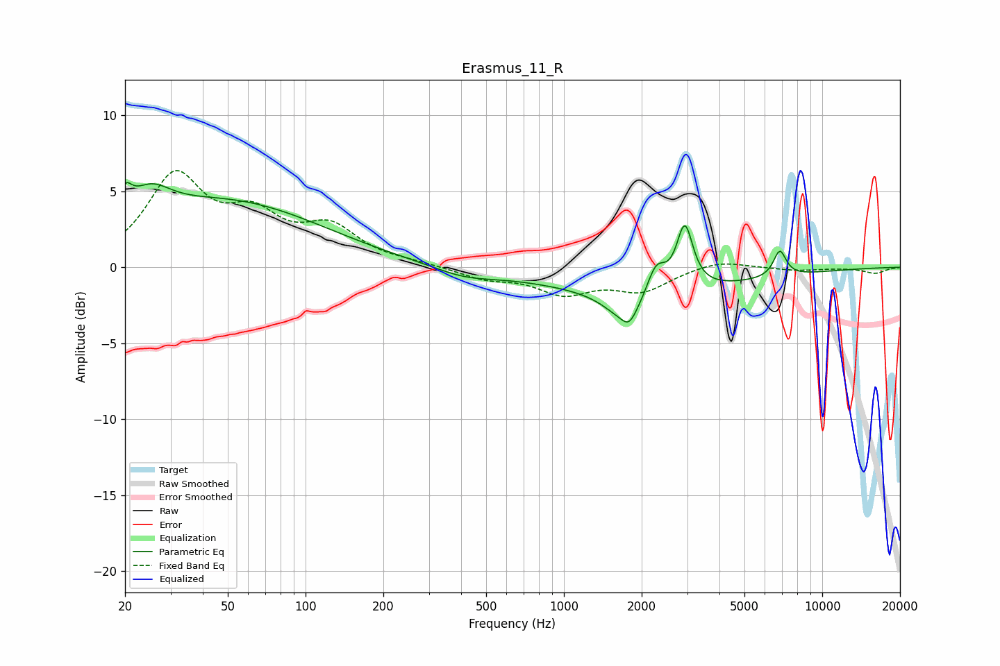

# Erasmus_11_R
See [usage instructions](https://github.com/jaakkopasanen/AutoEq#usage) for more options and info.

### Parametric EQs
Apply preamp of -5.7 dB when using parametric equalizer.

|   # | Type    |   Fc (Hz) |    Q |   Gain (dB) |
|-----|---------|-----------|------|-------------|
|   1 | Peaking |        20 | 5.59 |         1.6 |
|   2 | Peaking |        25 | 1.77 |         2   |
|   3 | Peaking |        49 | 0.37 |         4.2 |
|   4 | Peaking |       411 | 1.2  |        -0.6 |
|   5 | Peaking |      1758 | 1.83 |        -2.1 |
|   6 | Peaking |      1788 | 5.85 |        -0.6 |
|   7 | Peaking |      2093 | 0.33 |        -1.5 |
|   8 | Peaking |      2272 | 3.75 |         2.1 |
|   9 | Peaking |      2938 | 4.55 |         4.2 |
|  10 | Peaking |      6850 | 5.58 |         1.7 |

### Fixed Band EQs
When using fixed band (also called graphic) equalizer, apply preamp of **-6.5 dB** (if available) and set gains manually with these parameters.

|   # | Type    |   Fc (Hz) |    Q |   Gain (dB) |
|-----|---------|-----------|------|-------------|
|   1 | Peaking |        31 | 1.41 |         5.8 |
|   2 | Peaking |        62 | 1.41 |         2.8 |
|   3 | Peaking |       125 | 1.41 |         2.3 |
|   4 | Peaking |       250 | 1.41 |         0.2 |
|   5 | Peaking |       500 | 1.41 |        -0.7 |
|   6 | Peaking |      1000 | 1.41 |        -1.6 |
|   7 | Peaking |      2000 | 1.41 |        -1.5 |
|   8 | Peaking |      4000 | 1.41 |         0.5 |
|   9 | Peaking |      8000 | 1.41 |        -0.2 |
|  10 | Peaking |     16000 | 1.41 |        -0.4 |

### Graphs

