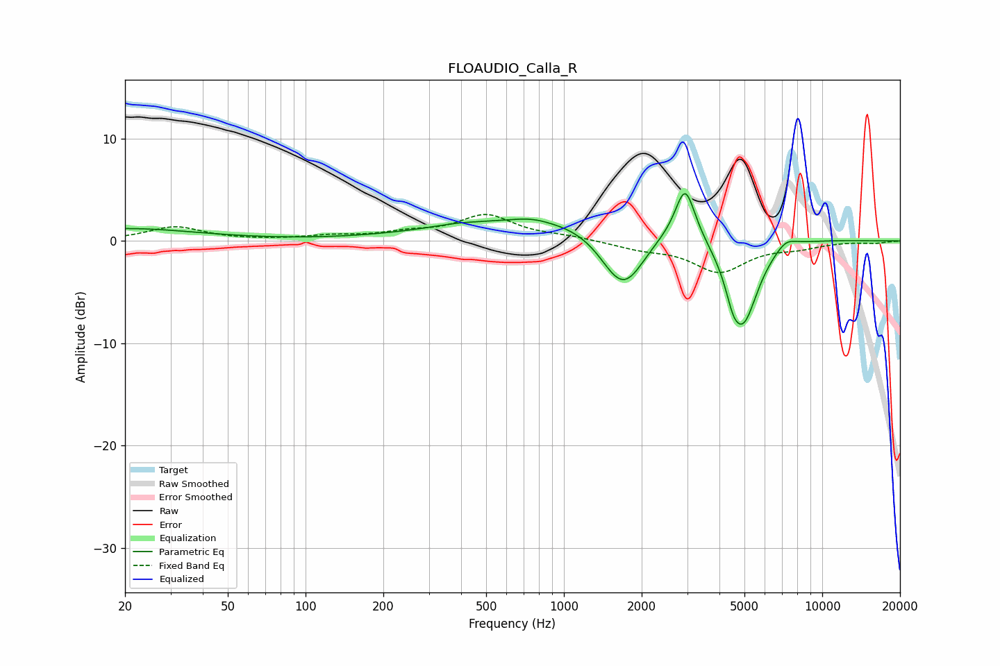

# FLOAUDIO_Calla_R
See [usage instructions](https://github.com/jaakkopasanen/AutoEq#usage) for more options and info.

### Parametric EQs
Apply preamp of -4.7 dB when using parametric equalizer.

|   # | Type    |   Fc (Hz) |    Q |   Gain (dB) |
|-----|---------|-----------|------|-------------|
|   1 | Peaking |        20 | 0.5  |         1.2 |
|   2 | Peaking |       385 | 1.64 |         0.2 |
|   3 | Peaking |       744 | 2.17 |         0.3 |
|   4 | Peaking |      1313 | 0.25 |         2.6 |
|   5 | Peaking |      1569 | 1.89 |        -1.3 |
|   6 | Peaking |      1731 | 1.69 |        -5.2 |
|   7 | Peaking |      2946 | 3.73 |         5.2 |
|   8 | Peaking |      4503 | 5.74 |        -1.4 |
|   9 | Peaking |      4923 | 2.23 |        -9   |
|  10 | Peaking |      7233 | 3.16 |         0.9 |

### Fixed Band EQs
When using fixed band (also called graphic) equalizer, apply preamp of **-2.7 dB** (if available) and set gains manually with these parameters.

|   # | Type    |   Fc (Hz) |    Q |   Gain (dB) |
|-----|---------|-----------|------|-------------|
|   1 | Peaking |        31 | 1.41 |         1.4 |
|   2 | Peaking |        62 | 1.41 |         0   |
|   3 | Peaking |       125 | 1.41 |         0.4 |
|   4 | Peaking |       250 | 1.41 |         0.7 |
|   5 | Peaking |       500 | 1.41 |         2.4 |
|   6 | Peaking |      1000 | 1.41 |         0.4 |
|   7 | Peaking |      2000 | 1.41 |        -0.6 |
|   8 | Peaking |      4000 | 1.41 |        -2.9 |
|   9 | Peaking |      8000 | 1.41 |        -0.5 |
|  10 | Peaking |     16000 | 1.41 |        -0.2 |

### Graphs

