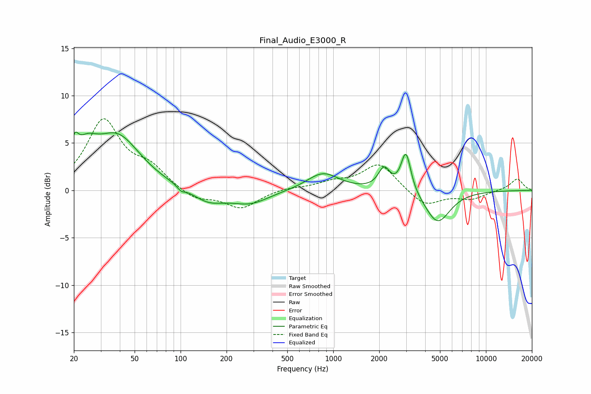

# Final_Audio_E3000_R
See [usage instructions](https://github.com/jaakkopasanen/AutoEq#usage) for more options and info.

### Parametric EQs
Apply preamp of -6.3 dB when using parametric equalizer.

|   # | Type    |   Fc (Hz) |    Q |   Gain (dB) |
|-----|---------|-----------|------|-------------|
|   1 | Peaking |        20 | 5.81 |         2.3 |
|   2 | Peaking |        24 | 1.99 |         2.6 |
|   3 | Peaking |        39 | 0.93 |         5.5 |
|   4 | Peaking |       101 | 5.87 |        -0.5 |
|   5 | Peaking |       152 | 1.32 |        -1.3 |
|   6 | Peaking |       285 | 1.13 |        -1.3 |
|   7 | Peaking |       856 | 1.36 |         1.9 |
|   8 | Peaking |      2154 | 3.74 |         2.2 |
|   9 | Peaking |      2993 | 4.44 |         4.3 |
|  10 | Peaking |      4821 | 1.72 |        -3.5 |

### Fixed Band EQs
When using fixed band (also called graphic) equalizer, apply preamp of **-7.7 dB** (if available) and set gains manually with these parameters.

|   # | Type    |   Fc (Hz) |    Q |   Gain (dB) |
|-----|---------|-----------|------|-------------|
|   1 | Peaking |        31 | 1.41 |         7.2 |
|   2 | Peaking |        62 | 1.41 |         2   |
|   3 | Peaking |       125 | 1.41 |        -1.1 |
|   4 | Peaking |       250 | 1.41 |        -1.9 |
|   5 | Peaking |       500 | 1.41 |         0.3 |
|   6 | Peaking |      1000 | 1.41 |         0.7 |
|   7 | Peaking |      2000 | 1.41 |         2.9 |
|   8 | Peaking |      4000 | 1.41 |        -1.7 |
|   9 | Peaking |      8000 | 1.41 |        -0.9 |
|  10 | Peaking |     16000 | 1.41 |         1.2 |

### Graphs

