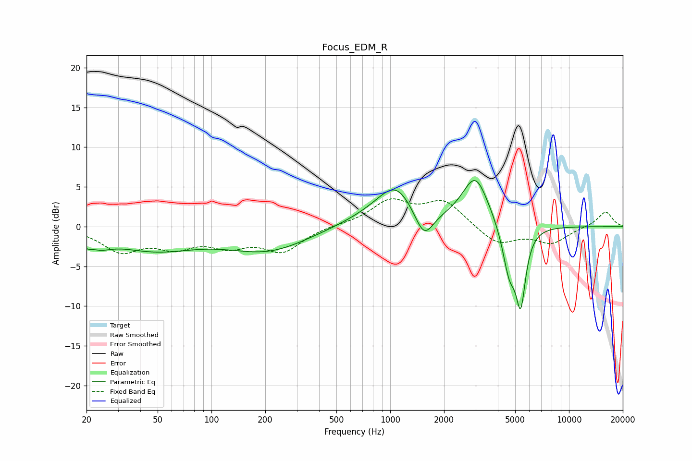

# Focus_EDM_R
See [usage instructions](https://github.com/jaakkopasanen/AutoEq#usage) for more options and info.

### Parametric EQs
Apply preamp of -5.9 dB when using parametric equalizer.

|   # | Type    |   Fc (Hz) |    Q |   Gain (dB) |
|-----|---------|-----------|------|-------------|
|   1 | Peaking |        20 | 5.96 |        -0.6 |
|   2 | Peaking |        23 | 2.02 |        -1.3 |
|   3 | Peaking |        48 | 0.6  |        -2.7 |
|   4 | Peaking |       207 | 0.62 |        -2.9 |
|   5 | Peaking |       908 | 0.72 |         1.6 |
|   6 | Peaking |      1074 | 1.45 |         3.9 |
|   7 | Peaking |      1545 | 2.67 |        -3.7 |
|   8 | Peaking |      2997 | 1.9  |         6.2 |
|   9 | Peaking |      4636 | 3.57 |        -5.8 |
|  10 | Peaking |      5373 | 5.07 |        -8.8 |

### Fixed Band EQs
When using fixed band (also called graphic) equalizer, apply preamp of **-3.6 dB** (if available) and set gains manually with these parameters.

|   # | Type    |   Fc (Hz) |    Q |   Gain (dB) |
|-----|---------|-----------|------|-------------|
|   1 | Peaking |        31 | 1.41 |        -2.9 |
|   2 | Peaking |        62 | 1.41 |        -2.2 |
|   3 | Peaking |       125 | 1.41 |        -2   |
|   4 | Peaking |       250 | 1.41 |        -3   |
|   5 | Peaking |       500 | 1.41 |         0.2 |
|   6 | Peaking |      1000 | 1.41 |         3.1 |
|   7 | Peaking |      2000 | 1.41 |         3.1 |
|   8 | Peaking |      4000 | 1.41 |        -2.3 |
|   9 | Peaking |      8000 | 1.41 |        -2   |
|  10 | Peaking |     16000 | 1.41 |         1.9 |

### Graphs

