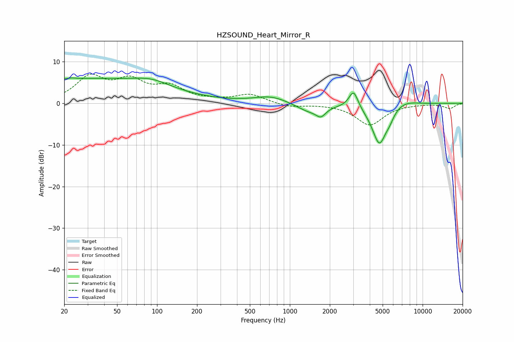

# HZSOUND_Heart_Mirror_R
See [usage instructions](https://github.com/jaakkopasanen/AutoEq#usage) for more options and info.

### Parametric EQs
Apply preamp of -6.2 dB when using parametric equalizer.

|   # | Type    |   Fc (Hz) |    Q |   Gain (dB) |
|-----|---------|-----------|------|-------------|
|   1 | Peaking |        23 | 5.85 |         0.2 |
|   2 | Peaking |        28 | 0.2  |         5.8 |
|   3 | Peaking |        91 | 1.09 |         1.6 |
|   4 | Peaking |       724 | 1.12 |         1.7 |
|   5 | Peaking |      1398 | 1.41 |        -2   |
|   6 | Peaking |      1714 | 3.94 |        -2   |
|   7 | Peaking |      3018 | 4.15 |         4.3 |
|   8 | Peaking |      4727 | 2.44 |        -9.9 |
|   9 | Peaking |      5655 | 4.7  |        -1.2 |
|  10 | Peaking |      7145 | 1.42 |         1.3 |

### Fixed Band EQs
When using fixed band (also called graphic) equalizer, apply preamp of **-7.1 dB** (if available) and set gains manually with these parameters.

|   # | Type    |   Fc (Hz) |    Q |   Gain (dB) |
|-----|---------|-----------|------|-------------|
|   1 | Peaking |        31 | 1.41 |         6   |
|   2 | Peaking |        62 | 1.41 |         4.7 |
|   3 | Peaking |       125 | 1.41 |         3.6 |
|   4 | Peaking |       250 | 1.41 |         0.4 |
|   5 | Peaking |       500 | 1.41 |         2.1 |
|   6 | Peaking |      1000 | 1.41 |        -0.9 |
|   7 | Peaking |      2000 | 1.41 |        -0.1 |
|   8 | Peaking |      4000 | 1.41 |        -5.1 |
|   9 | Peaking |      8000 | 1.41 |        -0.1 |
|  10 | Peaking |     16000 | 1.41 |        -1.2 |

### Graphs

