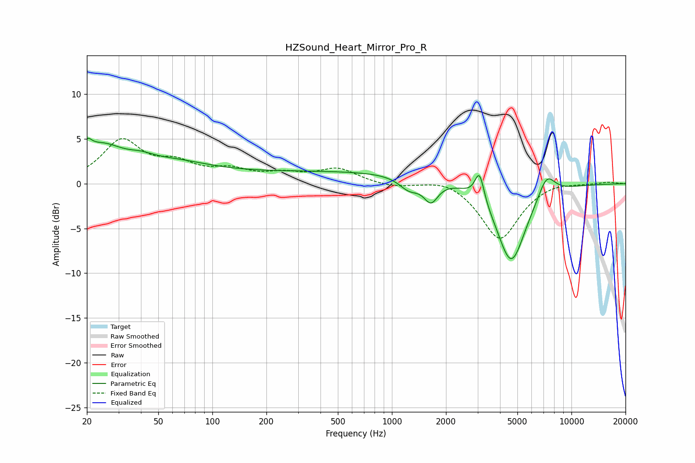

# HZSound_Heart_Mirror_Pro_R
See [usage instructions](https://github.com/jaakkopasanen/AutoEq#usage) for more options and info.

### Parametric EQs
Apply preamp of -5.2 dB when using parametric equalizer.

|   # | Type    |   Fc (Hz) |    Q |   Gain (dB) |
|-----|---------|-----------|------|-------------|
|   1 | Peaking |        20 | 5.34 |         1.6 |
|   2 | Peaking |        24 | 1.18 |         3.4 |
|   3 | Peaking |        40 | 1.96 |         0.6 |
|   4 | Peaking |        59 | 0.62 |         1.9 |
|   5 | Peaking |       609 | 0.19 |         1.4 |
|   6 | Peaking |      1247 | 2.49 |        -1.4 |
|   7 | Peaking |      1650 | 3.52 |        -2.4 |
|   8 | Peaking |      3075 | 5.61 |         3.2 |
|   9 | Peaking |      4616 | 1.68 |        -9.1 |
|  10 | Peaking |      7271 | 2.86 |         2.5 |

### Fixed Band EQs
When using fixed band (also called graphic) equalizer, apply preamp of **-5.1 dB** (if available) and set gains manually with these parameters.

|   # | Type    |   Fc (Hz) |    Q |   Gain (dB) |
|-----|---------|-----------|------|-------------|
|   1 | Peaking |        31 | 1.41 |         4.6 |
|   2 | Peaking |        62 | 1.41 |         1.9 |
|   3 | Peaking |       125 | 1.41 |         1.3 |
|   4 | Peaking |       250 | 1.41 |         0.9 |
|   5 | Peaking |       500 | 1.41 |         1.6 |
|   6 | Peaking |      1000 | 1.41 |        -0.4 |
|   7 | Peaking |      2000 | 1.41 |         0.7 |
|   8 | Peaking |      4000 | 1.41 |        -6.3 |
|   9 | Peaking |      8000 | 1.41 |         0.4 |
|  10 | Peaking |     16000 | 1.41 |         0.2 |

### Graphs

