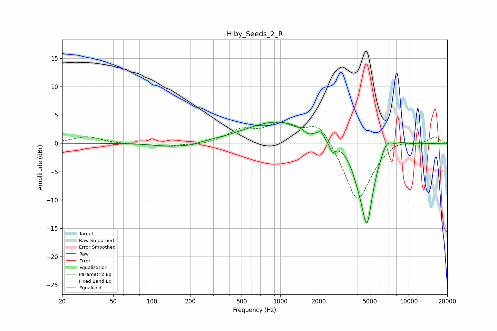

# Hiby_Seeds_2_R
See [usage instructions](https://github.com/jaakkopasanen/AutoEq#usage) for more options and info.

### Parametric EQs
Apply preamp of -3.8 dB when using parametric equalizer.

|   # | Type    |   Fc (Hz) |    Q |   Gain (dB) |
|-----|---------|-----------|------|-------------|
|   1 | Peaking |       143 | 1.13 |        -0.7 |
|   2 | Peaking |       204 | 2.37 |        -0.4 |
|   3 | Peaking |       959 | 0.57 |         3.9 |
|   4 | Peaking |      1647 | 5.02 |        -0.7 |
|   5 | Peaking |      2068 | 6    |         1   |
|   6 | Peaking |      2550 | 6    |        -1.8 |
|   7 | Peaking |      4018 | 2.93 |        -2   |
|   8 | Peaking |      4729 | 2.81 |       -13.9 |
|   9 | Peaking |      6743 | 3.12 |         2.2 |
|  10 | Peaking |      8771 | 2.37 |         0.6 |

### Fixed Band EQs
When using fixed band (also called graphic) equalizer, apply preamp of **-3.8 dB** (if available) and set gains manually with these parameters.

|   # | Type    |   Fc (Hz) |    Q |   Gain (dB) |
|-----|---------|-----------|------|-------------|
|   1 | Peaking |        31 | 1.41 |         1.2 |
|   2 | Peaking |        62 | 1.41 |        -0.2 |
|   3 | Peaking |       125 | 1.41 |        -0.6 |
|   4 | Peaking |       250 | 1.41 |        -0.3 |
|   5 | Peaking |       500 | 1.41 |         2.2 |
|   6 | Peaking |      1000 | 1.41 |         3.1 |
|   7 | Peaking |      2000 | 1.41 |         4   |
|   8 | Peaking |      4000 | 1.41 |       -10.7 |
|   9 | Peaking |      8000 | 1.41 |         1.1 |
|  10 | Peaking |     16000 | 1.41 |         1.2 |

### Graphs

