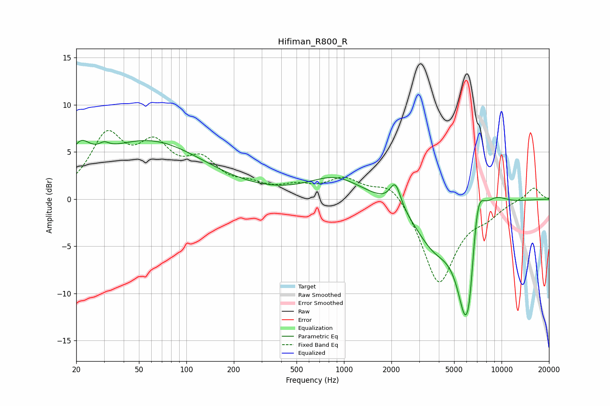

# Hifiman_R800_R
See [usage instructions](https://github.com/jaakkopasanen/AutoEq#usage) for more options and info.

### Parametric EQs
Apply preamp of -6.3 dB when using parametric equalizer.

|   # | Type    |   Fc (Hz) |    Q |   Gain (dB) |
|-----|---------|-----------|------|-------------|
|   1 | Peaking |        21 | 2.26 |         2.8 |
|   2 | Peaking |        30 | 4.41 |         0.6 |
|   3 | Peaking |        57 | 0.39 |         6.1 |
|   4 | Peaking |       886 | 0.83 |         2.3 |
|   5 | Peaking |      2119 | 4.09 |         2.6 |
|   6 | Peaking |      3721 | 1.12 |        -4.2 |
|   7 | Peaking |      5929 | 2.27 |       -12   |
|   8 | Peaking |      6287 | 6    |        -2.3 |
|   9 | Peaking |      7043 | 3.05 |         6.1 |
|  10 | Peaking |      9092 | 1.72 |         1.4 |

### Fixed Band EQs
When using fixed band (also called graphic) equalizer, apply preamp of **-7.4 dB** (if available) and set gains manually with these parameters.

|   # | Type    |   Fc (Hz) |    Q |   Gain (dB) |
|-----|---------|-----------|------|-------------|
|   1 | Peaking |        31 | 1.41 |         6.2 |
|   2 | Peaking |        62 | 1.41 |         4.7 |
|   3 | Peaking |       125 | 1.41 |         3.4 |
|   4 | Peaking |       250 | 1.41 |         1.1 |
|   5 | Peaking |       500 | 1.41 |         1   |
|   6 | Peaking |      1000 | 1.41 |         2   |
|   7 | Peaking |      2000 | 1.41 |         2.2 |
|   8 | Peaking |      4000 | 1.41 |        -9.1 |
|   9 | Peaking |      8000 | 1.41 |        -1.3 |
|  10 | Peaking |     16000 | 1.41 |         1.3 |

### Graphs

