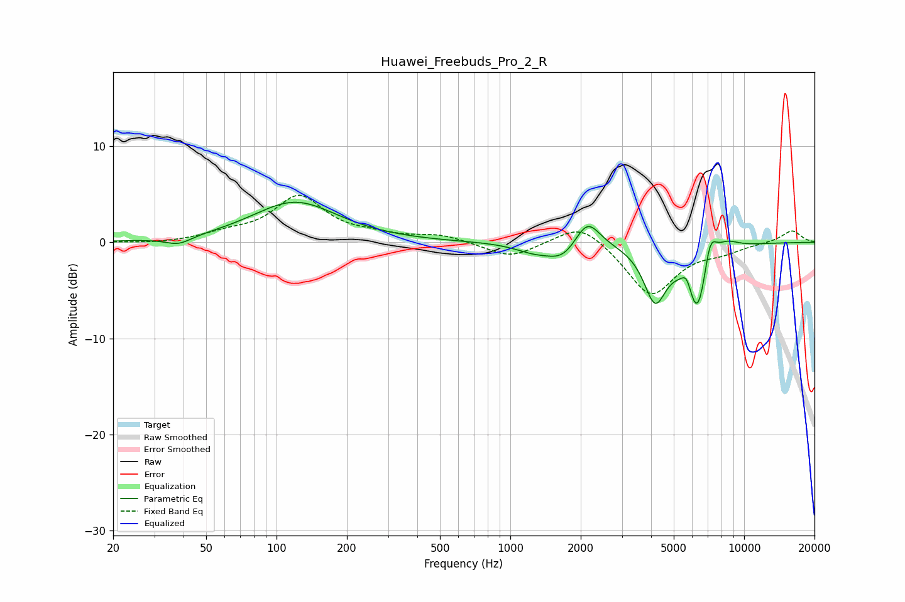

# Huawei_Freebuds_Pro_2_R
See [usage instructions](https://github.com/jaakkopasanen/AutoEq#usage) for more options and info.

### Parametric EQs
Apply preamp of -4.3 dB when using parametric equalizer.

|   # | Type    |   Fc (Hz) |    Q |   Gain (dB) |
|-----|---------|-----------|------|-------------|
|   1 | Peaking |        38 | 2.56 |        -0.8 |
|   2 | Peaking |       120 | 0.78 |         4.2 |
|   3 | Peaking |      1256 | 1.74 |        -0.8 |
|   4 | Peaking |      1682 | 2.08 |        -1.7 |
|   5 | Peaking |      2133 | 2.62 |         3   |
|   6 | Peaking |      4160 | 2.92 |        -5.6 |
|   7 | Peaking |      5685 | 5.98 |         1.9 |
|   8 | Peaking |      6334 | 2.72 |        -8.1 |
|   9 | Peaking |      7135 | 4.59 |         4.1 |
|  10 | Peaking |      8337 | 2.41 |         1.2 |

### Fixed Band EQs
When using fixed band (also called graphic) equalizer, apply preamp of **-5.0 dB** (if available) and set gains manually with these parameters.

|   # | Type    |   Fc (Hz) |    Q |   Gain (dB) |
|-----|---------|-----------|------|-------------|
|   1 | Peaking |        31 | 1.41 |        -0.2 |
|   2 | Peaking |        62 | 1.41 |         0.7 |
|   3 | Peaking |       125 | 1.41 |         4.6 |
|   4 | Peaking |       250 | 1.41 |         0.5 |
|   5 | Peaking |       500 | 1.41 |         0.7 |
|   6 | Peaking |      1000 | 1.41 |        -1.6 |
|   7 | Peaking |      2000 | 1.41 |         2.3 |
|   8 | Peaking |      4000 | 1.41 |        -5.6 |
|   9 | Peaking |      8000 | 1.41 |        -0.8 |
|  10 | Peaking |     16000 | 1.41 |         1.3 |

### Graphs

