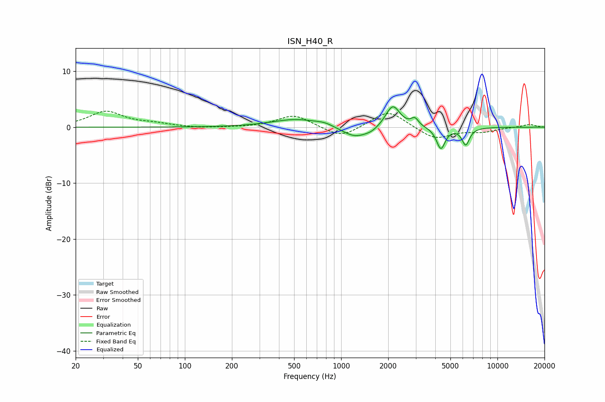

# ISN_H40_R
See [usage instructions](https://github.com/jaakkopasanen/AutoEq#usage) for more options and info.

### Parametric EQs
Apply preamp of -3.7 dB when using parametric equalizer.

|   # | Type    |   Fc (Hz) |    Q |   Gain (dB) |
|-----|---------|-----------|------|-------------|
|   1 | Peaking |       345 | 1.06 |         0.1 |
|   2 | Peaking |       521 | 0.98 |         1.4 |
|   3 | Peaking |       785 | 2.42 |         0.5 |
|   4 | Peaking |      1235 | 1.63 |        -2.1 |
|   5 | Peaking |      1573 | 3.51 |        -0.4 |
|   6 | Peaking |      2132 | 3.15 |         3.5 |
|   7 | Peaking |      2187 | 2.98 |         0.6 |
|   8 | Peaking |      2964 | 6    |         1.3 |
|   9 | Peaking |      4346 | 5.08 |        -3.8 |
|  10 | Peaking |      6267 | 5.62 |        -3   |

### Fixed Band EQs
When using fixed band (also called graphic) equalizer, apply preamp of **-3.0 dB** (if available) and set gains manually with these parameters.

|   # | Type    |   Fc (Hz) |    Q |   Gain (dB) |
|-----|---------|-----------|------|-------------|
|   1 | Peaking |        31 | 1.41 |         2.8 |
|   2 | Peaking |        62 | 1.41 |         0.5 |
|   3 | Peaking |       125 | 1.41 |        -0.2 |
|   4 | Peaking |       250 | 1.41 |        -0.1 |
|   5 | Peaking |       500 | 1.41 |         2.2 |
|   6 | Peaking |      1000 | 1.41 |        -2   |
|   7 | Peaking |      2000 | 1.41 |         3.1 |
|   8 | Peaking |      4000 | 1.41 |        -2.2 |
|   9 | Peaking |      8000 | 1.41 |        -0.7 |
|  10 | Peaking |     16000 | 1.41 |         0.5 |

### Graphs

