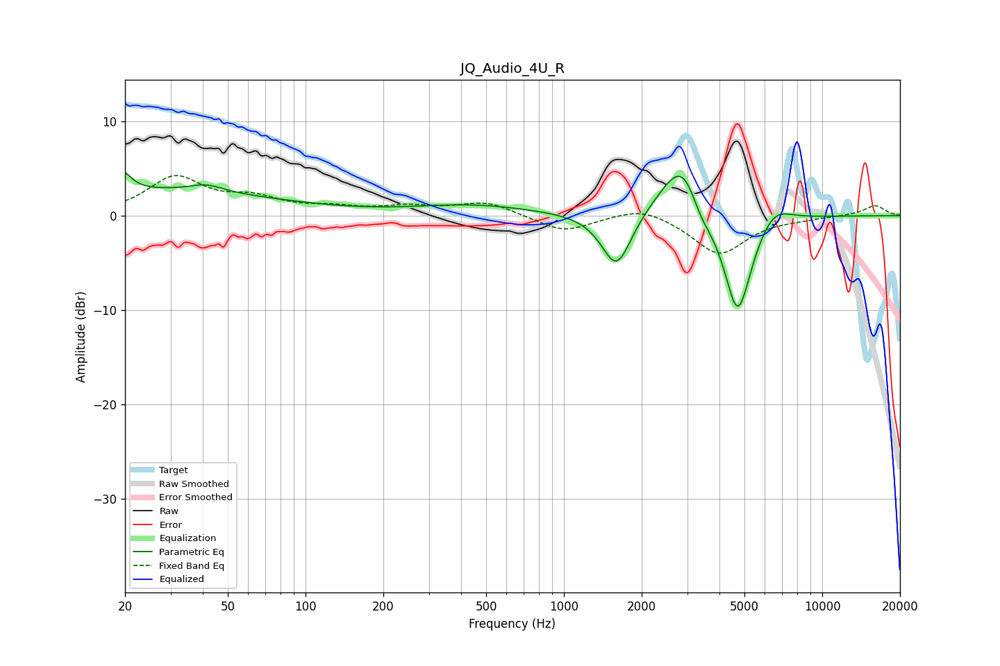

# JQ_Audio_4U_R
See [usage instructions](https://github.com/jaakkopasanen/AutoEq#usage) for more options and info.

### Parametric EQs
Apply preamp of -4.6 dB when using parametric equalizer.

|   # | Type    |   Fc (Hz) |    Q |   Gain (dB) |
|-----|---------|-----------|------|-------------|
|   1 | Peaking |        20 | 5.27 |         3.5 |
|   2 | Peaking |        20 | 6    |        -1.7 |
|   3 | Peaking |        23 | 0.26 |         2.6 |
|   4 | Peaking |        41 | 2.25 |         0.8 |
|   5 | Peaking |       443 | 0.63 |         1.1 |
|   6 | Peaking |      1599 | 2.42 |        -6.1 |
|   7 | Peaking |      2930 | 1.6  |         7.7 |
|   8 | Peaking |      3368 | 2.9  |        -2.7 |
|   9 | Peaking |      4705 | 2.4  |       -11.8 |
|  10 | Peaking |      6445 | 2.02 |         2.3 |

### Fixed Band EQs
When using fixed band (also called graphic) equalizer, apply preamp of **-4.3 dB** (if available) and set gains manually with these parameters.

|   # | Type    |   Fc (Hz) |    Q |   Gain (dB) |
|-----|---------|-----------|------|-------------|
|   1 | Peaking |        31 | 1.41 |         3.9 |
|   2 | Peaking |        62 | 1.41 |         1.5 |
|   3 | Peaking |       125 | 1.41 |         0.7 |
|   4 | Peaking |       250 | 1.41 |         0.8 |
|   5 | Peaking |       500 | 1.41 |         1.4 |
|   6 | Peaking |      1000 | 1.41 |        -1.8 |
|   7 | Peaking |      2000 | 1.41 |         1.2 |
|   8 | Peaking |      4000 | 1.41 |        -4.1 |
|   9 | Peaking |      8000 | 1.41 |        -0.2 |
|  10 | Peaking |     16000 | 1.41 |         1.1 |

### Graphs

