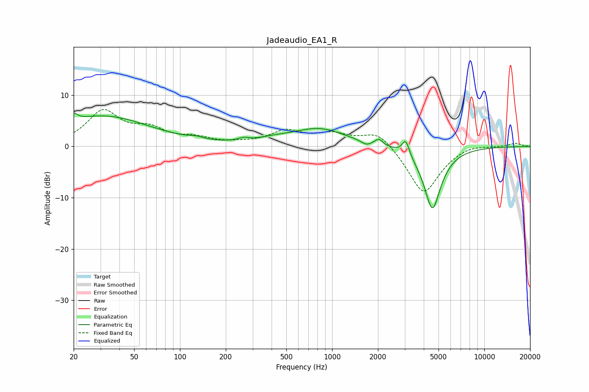

# Jadeaudio_EA1_R
See [usage instructions](https://github.com/jaakkopasanen/AutoEq#usage) for more options and info.

### Parametric EQs
Apply preamp of -6.5 dB when using parametric equalizer.

|   # | Type    |   Fc (Hz) |    Q |   Gain (dB) |
|-----|---------|-----------|------|-------------|
|   1 | Peaking |        20 | 5.75 |         1.4 |
|   2 | Peaking |        31 | 0.45 |         5.9 |
|   3 | Peaking |       127 | 3.32 |         0.4 |
|   4 | Peaking |       263 | 4.09 |         0.5 |
|   5 | Peaking |       415 | 1.32 |         0.7 |
|   6 | Peaking |       821 | 0.81 |         3.4 |
|   7 | Peaking |      1671 | 4.67 |        -0.7 |
|   8 | Peaking |      2029 | 5.7  |         1.2 |
|   9 | Peaking |      3048 | 6    |         3   |
|  10 | Peaking |      4561 | 2.44 |       -12.3 |

### Fixed Band EQs
When using fixed band (also called graphic) equalizer, apply preamp of **-7.3 dB** (if available) and set gains manually with these parameters.

|   # | Type    |   Fc (Hz) |    Q |   Gain (dB) |
|-----|---------|-----------|------|-------------|
|   1 | Peaking |        31 | 1.41 |         6.6 |
|   2 | Peaking |        62 | 1.41 |         2.8 |
|   3 | Peaking |       125 | 1.41 |         1.3 |
|   4 | Peaking |       250 | 1.41 |         0.3 |
|   5 | Peaking |       500 | 1.41 |         2.8 |
|   6 | Peaking |      1000 | 1.41 |         2.1 |
|   7 | Peaking |      2000 | 1.41 |         3.2 |
|   8 | Peaking |      4000 | 1.41 |        -9.5 |
|   9 | Peaking |      8000 | 1.41 |         0.7 |
|  10 | Peaking |     16000 | 1.41 |         0.7 |

### Graphs

