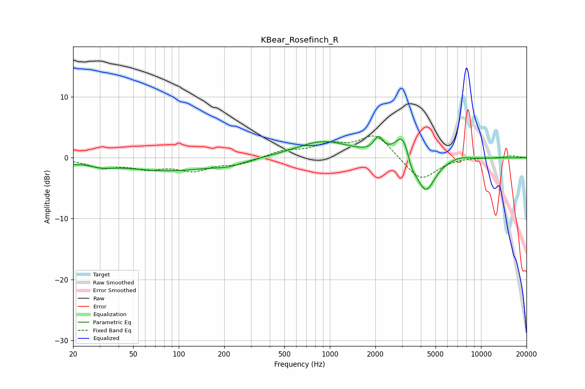

# KBear_Rosefinch_R
See [usage instructions](https://github.com/jaakkopasanen/AutoEq#usage) for more options and info.

### Parametric EQs
Apply preamp of -3.6 dB when using parametric equalizer.

|   # | Type    |   Fc (Hz) |    Q |   Gain (dB) |
|-----|---------|-----------|------|-------------|
|   1 | Peaking |        20 | 4.23 |        -0.4 |
|   2 | Peaking |        30 | 1.63 |        -0.8 |
|   3 | Peaking |        85 | 0.47 |        -2.1 |
|   4 | Peaking |       213 | 1.55 |        -0.7 |
|   5 | Peaking |       905 | 0.78 |         2.7 |
|   6 | Peaking |      2099 | 4.72 |         2.4 |
|   7 | Peaking |      3035 | 2.82 |         4.4 |
|   8 | Peaking |      3492 | 5.46 |        -1.7 |
|   9 | Peaking |      4288 | 2.21 |        -6   |
|  10 | Peaking |      7189 | 2.14 |         0.5 |

### Fixed Band EQs
When using fixed band (also called graphic) equalizer, apply preamp of **-3.7 dB** (if available) and set gains manually with these parameters.

|   # | Type    |   Fc (Hz) |    Q |   Gain (dB) |
|-----|---------|-----------|------|-------------|
|   1 | Peaking |        31 | 1.41 |        -1.4 |
|   2 | Peaking |        62 | 1.41 |        -1.5 |
|   3 | Peaking |       125 | 1.41 |        -1.9 |
|   4 | Peaking |       250 | 1.41 |        -1   |
|   5 | Peaking |       500 | 1.41 |         1.1 |
|   6 | Peaking |      1000 | 1.41 |         1.9 |
|   7 | Peaking |      2000 | 1.41 |         3.8 |
|   8 | Peaking |      4000 | 1.41 |        -3.9 |
|   9 | Peaking |      8000 | 1.41 |         0.1 |
|  10 | Peaking |     16000 | 1.41 |         0.3 |

### Graphs

