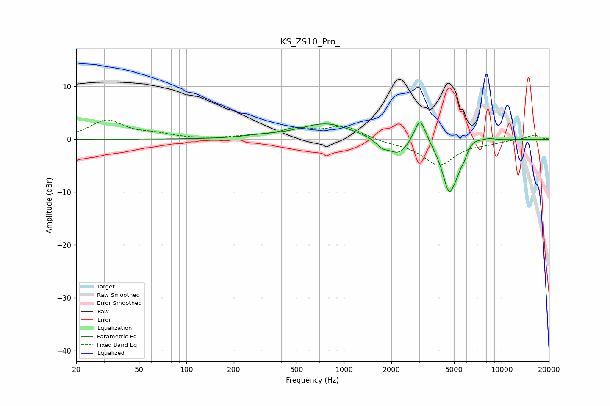

# KS_ZS10_Pro_L
See [usage instructions](https://github.com/jaakkopasanen/AutoEq#usage) for more options and info.

### Parametric EQs
Apply preamp of -3.2 dB when using parametric equalizer.

|   # | Type    |   Fc (Hz) |    Q |   Gain (dB) |
|-----|---------|-----------|------|-------------|
|   1 | Peaking |       303 | 1.24 |         0.4 |
|   2 | Peaking |       771 | 0.86 |         3   |
|   3 | Peaking |      1741 | 3.79 |        -1.2 |
|   4 | Peaking |      2223 | 2.12 |        -3   |
|   5 | Peaking |      3038 | 3.67 |         5.2 |
|   6 | Peaking |      4648 | 3.05 |        -9.7 |
|   7 | Peaking |      5226 | 4.96 |        -1.4 |
|   8 | Peaking |      5803 | 6    |        -1.2 |
|   9 | Peaking |      6541 | 2.93 |         1   |
|  10 | Peaking |      8260 | 2.84 |         0.5 |

### Fixed Band EQs
When using fixed band (also called graphic) equalizer, apply preamp of **-3.7 dB** (if available) and set gains manually with these parameters.

|   # | Type    |   Fc (Hz) |    Q |   Gain (dB) |
|-----|---------|-----------|------|-------------|
|   1 | Peaking |        31 | 1.41 |         3.5 |
|   2 | Peaking |        62 | 1.41 |         0.8 |
|   3 | Peaking |       125 | 1.41 |        -0   |
|   4 | Peaking |       250 | 1.41 |         0.4 |
|   5 | Peaking |       500 | 1.41 |         1.8 |
|   6 | Peaking |      1000 | 1.41 |         2.3 |
|   7 | Peaking |      2000 | 1.41 |        -0.6 |
|   8 | Peaking |      4000 | 1.41 |        -4.8 |
|   9 | Peaking |      8000 | 1.41 |        -0.6 |
|  10 | Peaking |     16000 | 1.41 |         0.8 |

### Graphs

