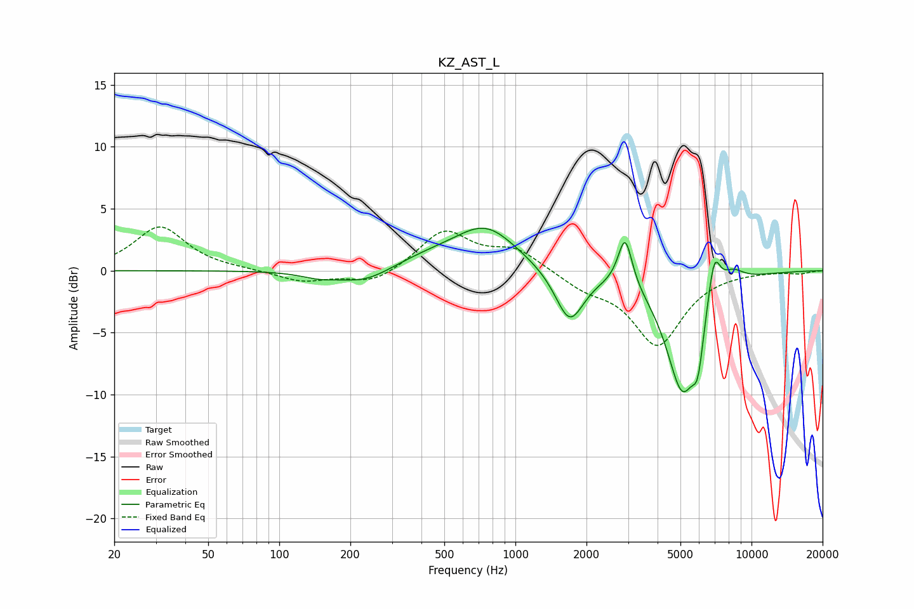

# KZ_AST_L
See [usage instructions](https://github.com/jaakkopasanen/AutoEq#usage) for more options and info.

### Parametric EQs
Apply preamp of -3.5 dB when using parametric equalizer.

|   # | Type    |   Fc (Hz) |    Q |   Gain (dB) |
|-----|---------|-----------|------|-------------|
|   1 | Peaking |       147 | 1.81 |        -0.5 |
|   2 | Peaking |       231 | 1.26 |        -1.2 |
|   3 | Peaking |       434 | 0.87 |         0.9 |
|   4 | Peaking |       752 | 1.08 |         3.3 |
|   5 | Peaking |      1696 | 2.34 |        -4.3 |
|   6 | Peaking |      2915 | 4.73 |         4.1 |
|   7 | Peaking |      5102 | 1.95 |        -9.6 |
|   8 | Peaking |      5931 | 6    |        -3.2 |
|   9 | Peaking |      6945 | 5.01 |         3.8 |
|  10 | Peaking |      8265 | 2.64 |         1.2 |

### Fixed Band EQs
When using fixed band (also called graphic) equalizer, apply preamp of **-3.6 dB** (if available) and set gains manually with these parameters.

|   # | Type    |   Fc (Hz) |    Q |   Gain (dB) |
|-----|---------|-----------|------|-------------|
|   1 | Peaking |        31 | 1.41 |         3.5 |
|   2 | Peaking |        62 | 1.41 |         0.1 |
|   3 | Peaking |       125 | 1.41 |        -0.9 |
|   4 | Peaking |       250 | 1.41 |        -1.1 |
|   5 | Peaking |       500 | 1.41 |         3.2 |
|   6 | Peaking |      1000 | 1.41 |         1.6 |
|   7 | Peaking |      2000 | 1.41 |        -1.2 |
|   8 | Peaking |      4000 | 1.41 |        -5.9 |
|   9 | Peaking |      8000 | 1.41 |        -0   |
|  10 | Peaking |     16000 | 1.41 |        -0.2 |

### Graphs

