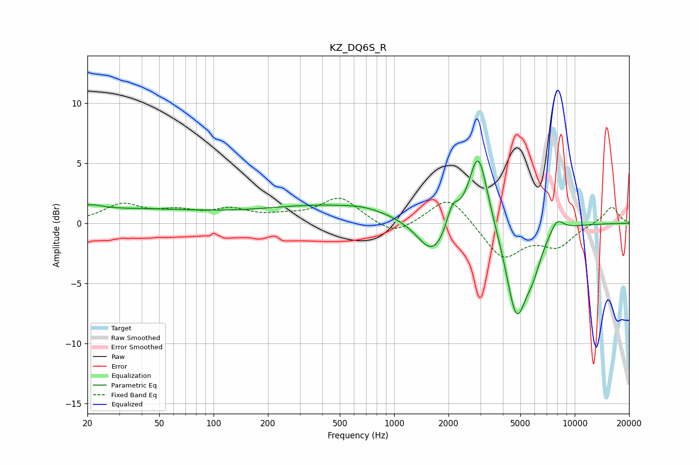

# KZ_DQ6S_R
See [usage instructions](https://github.com/jaakkopasanen/AutoEq#usage) for more options and info.

### Parametric EQs
Apply preamp of -5.3 dB when using parametric equalizer.

|   # | Type    |   Fc (Hz) |    Q |   Gain (dB) |
|-----|---------|-----------|------|-------------|
|   1 | Peaking |        21 | 2.27 |         0.5 |
|   2 | Peaking |        34 | 0.31 |         1.1 |
|   3 | Peaking |       444 | 0.37 |         1.5 |
|   4 | Peaking |       677 | 1.51 |         0.2 |
|   5 | Peaking |      1645 | 1.63 |        -3.2 |
|   6 | Peaking |      2100 | 4.38 |         1.9 |
|   7 | Peaking |      2924 | 2.65 |         6.6 |
|   8 | Peaking |      4756 | 2.38 |        -7.6 |
|   9 | Peaking |      5878 | 2.91 |        -2   |
|  10 | Peaking |      7968 | 3.6  |         1.1 |

### Fixed Band EQs
When using fixed band (also called graphic) equalizer, apply preamp of **-2.2 dB** (if available) and set gains manually with these parameters.

|   # | Type    |   Fc (Hz) |    Q |   Gain (dB) |
|-----|---------|-----------|------|-------------|
|   1 | Peaking |        31 | 1.41 |         1.5 |
|   2 | Peaking |        62 | 1.41 |         0.8 |
|   3 | Peaking |       125 | 1.41 |         1   |
|   4 | Peaking |       250 | 1.41 |         0.4 |
|   5 | Peaking |       500 | 1.41 |         2.1 |
|   6 | Peaking |      1000 | 1.41 |        -1.2 |
|   7 | Peaking |      2000 | 1.41 |         2.4 |
|   8 | Peaking |      4000 | 1.41 |        -2.9 |
|   9 | Peaking |      8000 | 1.41 |        -1.8 |
|  10 | Peaking |     16000 | 1.41 |         1.4 |

### Graphs

