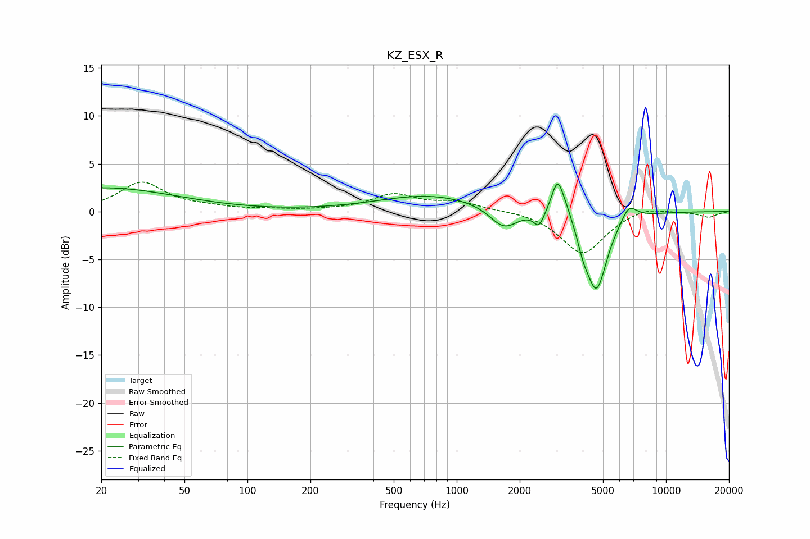

# KZ_ESX_R
See [usage instructions](https://github.com/jaakkopasanen/AutoEq#usage) for more options and info.

### Parametric EQs
Apply preamp of -3.0 dB when using parametric equalizer.

|   # | Type    |   Fc (Hz) |    Q |   Gain (dB) |
|-----|---------|-----------|------|-------------|
|   1 | Peaking |        20 | 0.39 |         2.5 |
|   2 | Peaking |       751 | 0.57 |         1.7 |
|   3 | Peaking |      1490 | 1.62 |         0.1 |
|   4 | Peaking |      1676 | 2.09 |        -2.3 |
|   5 | Peaking |      2471 | 5.97 |        -1.5 |
|   6 | Peaking |      3032 | 4.82 |         3.8 |
|   7 | Peaking |      3355 | 4.2  |         0.9 |
|   8 | Peaking |      4025 | 5.54 |        -1.3 |
|   9 | Peaking |      4650 | 2.71 |        -8.2 |
|  10 | Peaking |      6648 | 3.68 |         1.7 |

### Fixed Band EQs
When using fixed band (also called graphic) equalizer, apply preamp of **-3.2 dB** (if available) and set gains manually with these parameters.

|   # | Type    |   Fc (Hz) |    Q |   Gain (dB) |
|-----|---------|-----------|------|-------------|
|   1 | Peaking |        31 | 1.41 |         3   |
|   2 | Peaking |        62 | 1.41 |         0.3 |
|   3 | Peaking |       125 | 1.41 |         0.2 |
|   4 | Peaking |       250 | 1.41 |         0.1 |
|   5 | Peaking |       500 | 1.41 |         1.7 |
|   6 | Peaking |      1000 | 1.41 |         0.9 |
|   7 | Peaking |      2000 | 1.41 |         0.1 |
|   8 | Peaking |      4000 | 1.41 |        -4.4 |
|   9 | Peaking |      8000 | 1.41 |         0.6 |
|  10 | Peaking |     16000 | 1.41 |        -0.6 |

### Graphs

