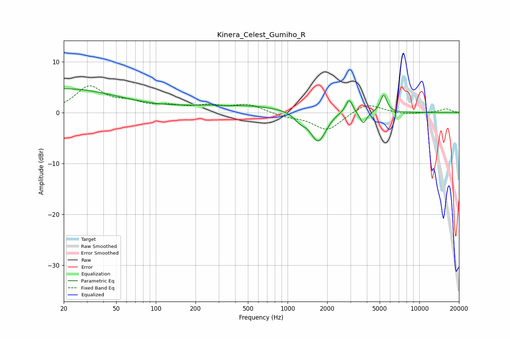

# Kinera_Celest_Gumiho_R
See [usage instructions](https://github.com/jaakkopasanen/AutoEq#usage) for more options and info.

### Parametric EQs
Apply preamp of -4.8 dB when using parametric equalizer.

|   # | Type    |   Fc (Hz) |    Q |   Gain (dB) |
|-----|---------|-----------|------|-------------|
|   1 | Peaking |        20 | 0.33 |         4.6 |
|   2 | Peaking |       350 | 3.05 |        -0.2 |
|   3 | Peaking |       412 | 0.36 |         1.4 |
|   4 | Peaking |      1245 | 3.05 |        -1.4 |
|   5 | Peaking |      1696 | 2.45 |        -5.3 |
|   6 | Peaking |      1902 | 2.11 |        -0.9 |
|   7 | Peaking |      2255 | 1.97 |         0.6 |
|   8 | Peaking |      2934 | 5.35 |         2.9 |
|   9 | Peaking |      3756 | 5.71 |        -2.3 |
|  10 | Peaking |      5358 | 5.53 |         3.5 |

### Fixed Band EQs
When using fixed band (also called graphic) equalizer, apply preamp of **-5.3 dB** (if available) and set gains manually with these parameters.

|   # | Type    |   Fc (Hz) |    Q |   Gain (dB) |
|-----|---------|-----------|------|-------------|
|   1 | Peaking |        31 | 1.41 |         4.9 |
|   2 | Peaking |        62 | 1.41 |         1.6 |
|   3 | Peaking |       125 | 1.41 |         1   |
|   4 | Peaking |       250 | 1.41 |         1.2 |
|   5 | Peaking |       500 | 1.41 |         1.5 |
|   6 | Peaking |      1000 | 1.41 |        -0.7 |
|   7 | Peaking |      2000 | 1.41 |        -3.5 |
|   8 | Peaking |      4000 | 1.41 |         2   |
|   9 | Peaking |      8000 | 1.41 |        -0.4 |
|  10 | Peaking |     16000 | 1.41 |         0.7 |

### Graphs

