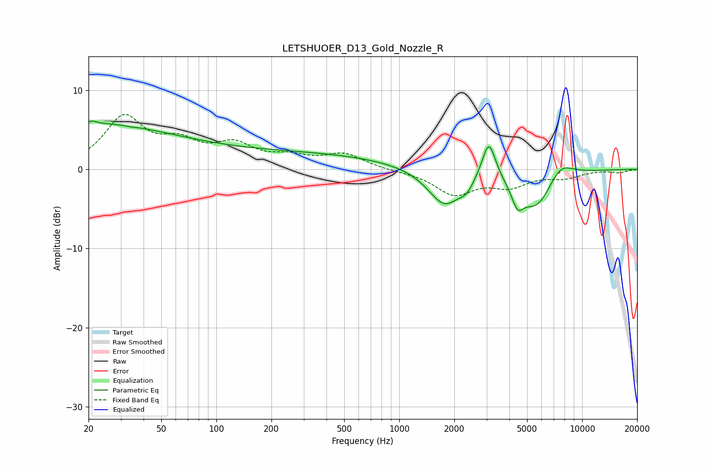

# LETSHUOER_D13_Gold_Nozzle_R
See [usage instructions](https://github.com/jaakkopasanen/AutoEq#usage) for more options and info.

### Parametric EQs
Apply preamp of -6.2 dB when using parametric equalizer.

|   # | Type    |   Fc (Hz) |    Q |   Gain (dB) |
|-----|---------|-----------|------|-------------|
|   1 | Peaking |        20 | 0.34 |         5.3 |
|   2 | Peaking |        21 | 5.39 |         0.4 |
|   3 | Peaking |        34 | 5.97 |        -0.1 |
|   4 | Peaking |       214 | 0.22 |         2.1 |
|   5 | Peaking |      1769 | 1.55 |        -4.6 |
|   6 | Peaking |      2337 | 3.78 |        -1.2 |
|   7 | Peaking |      3088 | 3.84 |         5   |
|   8 | Peaking |      4432 | 4.37 |        -2.6 |
|   9 | Peaking |      5629 | 1.48 |        -4.9 |
|  10 | Peaking |      7568 | 1.9  |         2.2 |

### Fixed Band EQs
When using fixed band (also called graphic) equalizer, apply preamp of **-7.0 dB** (if available) and set gains manually with these parameters.

|   # | Type    |   Fc (Hz) |    Q |   Gain (dB) |
|-----|---------|-----------|------|-------------|
|   1 | Peaking |        31 | 1.41 |         6.3 |
|   2 | Peaking |        62 | 1.41 |         2.7 |
|   3 | Peaking |       125 | 1.41 |         2.7 |
|   4 | Peaking |       250 | 1.41 |         1.2 |
|   5 | Peaking |       500 | 1.41 |         1.8 |
|   6 | Peaking |      1000 | 1.41 |        -0.2 |
|   7 | Peaking |      2000 | 1.41 |        -3   |
|   8 | Peaking |      4000 | 1.41 |        -1.9 |
|   9 | Peaking |      8000 | 1.41 |        -0.9 |
|  10 | Peaking |     16000 | 1.41 |        -0.4 |

### Graphs

