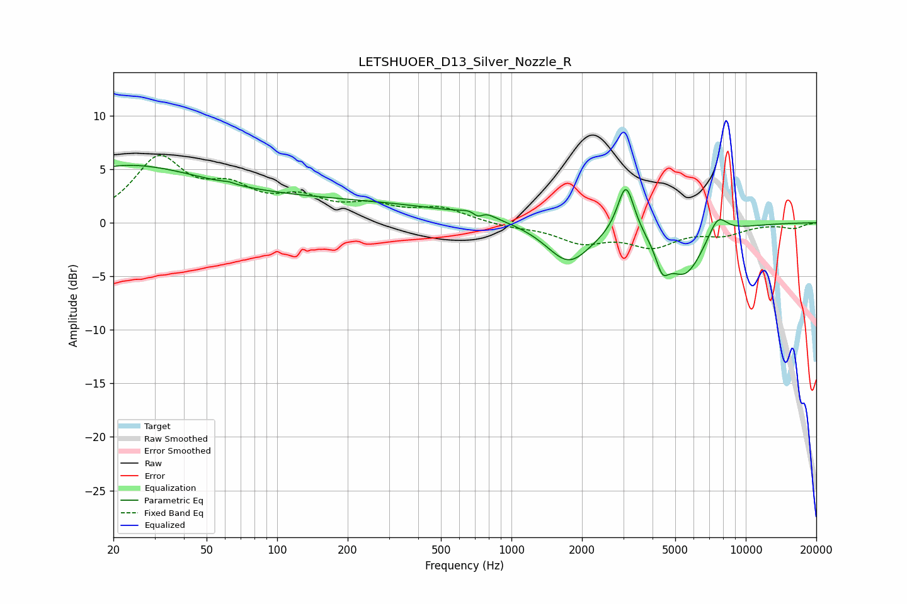

# LETSHUOER_D13_Silver_Nozzle_R
See [usage instructions](https://github.com/jaakkopasanen/AutoEq#usage) for more options and info.

### Parametric EQs
Apply preamp of -5.5 dB when using parametric equalizer.

|   # | Type    |   Fc (Hz) |    Q |   Gain (dB) |
|-----|---------|-----------|------|-------------|
|   1 | Peaking |        20 | 0.44 |         4.3 |
|   2 | Peaking |        62 | 5.93 |         0.2 |
|   3 | Peaking |       116 | 0.19 |         2.1 |
|   4 | Peaking |       720 | 5.27 |        -1.6 |
|   5 | Peaking |       722 | 3.51 |         1.7 |
|   6 | Peaking |      1754 | 1.48 |        -3.7 |
|   7 | Peaking |      3079 | 3.95 |         4.9 |
|   8 | Peaking |      4406 | 5.02 |        -2.3 |
|   9 | Peaking |      5490 | 1.65 |        -4.7 |
|  10 | Peaking |      7583 | 3.26 |         2.1 |

### Fixed Band EQs
When using fixed band (also called graphic) equalizer, apply preamp of **-6.4 dB** (if available) and set gains manually with these parameters.

|   # | Type    |   Fc (Hz) |    Q |   Gain (dB) |
|-----|---------|-----------|------|-------------|
|   1 | Peaking |        31 | 1.41 |         5.7 |
|   2 | Peaking |        62 | 1.41 |         2.6 |
|   3 | Peaking |       125 | 1.41 |         1.9 |
|   4 | Peaking |       250 | 1.41 |         1.3 |
|   5 | Peaking |       500 | 1.41 |         1.3 |
|   6 | Peaking |      1000 | 1.41 |        -0.3 |
|   7 | Peaking |      2000 | 1.41 |        -1.7 |
|   8 | Peaking |      4000 | 1.41 |        -2   |
|   9 | Peaking |      8000 | 1.41 |        -1   |
|  10 | Peaking |     16000 | 1.41 |        -0.5 |

### Graphs

