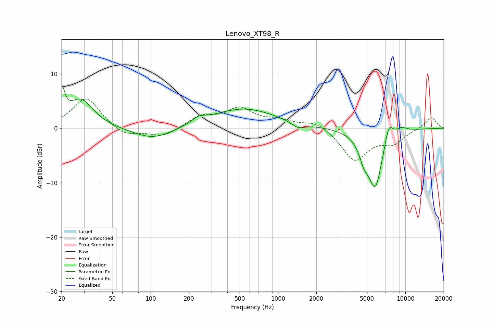

# Lenovo_XT98_R
See [usage instructions](https://github.com/jaakkopasanen/AutoEq#usage) for more options and info.

### Parametric EQs
Apply preamp of -8.0 dB when using parametric equalizer.

|   # | Type    |   Fc (Hz) |    Q |   Gain (dB) |
|-----|---------|-----------|------|-------------|
|   1 | Peaking |        20 | 5.94 |         5.4 |
|   2 | Peaking |        28 | 1.44 |         5.2 |
|   3 | Peaking |       105 | 0.9  |        -2.2 |
|   4 | Peaking |       239 | 2.76 |         1   |
|   5 | Peaking |       534 | 0.54 |         3.6 |
|   6 | Peaking |      1443 | 2.73 |        -1.1 |
|   7 | Peaking |      4738 | 3.73 |        -2.8 |
|   8 | Peaking |      5809 | 2.31 |       -10.7 |
|   9 | Peaking |      7407 | 3.97 |         3.7 |
|  10 | Peaking |      9290 | 2.69 |         1   |

### Fixed Band EQs
When using fixed band (also called graphic) equalizer, apply preamp of **-5.5 dB** (if available) and set gains manually with these parameters.

|   # | Type    |   Fc (Hz) |    Q |   Gain (dB) |
|-----|---------|-----------|------|-------------|
|   1 | Peaking |        31 | 1.41 |         5.7 |
|   2 | Peaking |        62 | 1.41 |        -1.6 |
|   3 | Peaking |       125 | 1.41 |        -1.6 |
|   4 | Peaking |       250 | 1.41 |         2.1 |
|   5 | Peaking |       500 | 1.41 |         3.4 |
|   6 | Peaking |      1000 | 1.41 |         1.2 |
|   7 | Peaking |      2000 | 1.41 |         1.4 |
|   8 | Peaking |      4000 | 1.41 |        -5.9 |
|   9 | Peaking |      8000 | 1.41 |        -2.4 |
|  10 | Peaking |     16000 | 1.41 |         2.1 |

### Graphs

