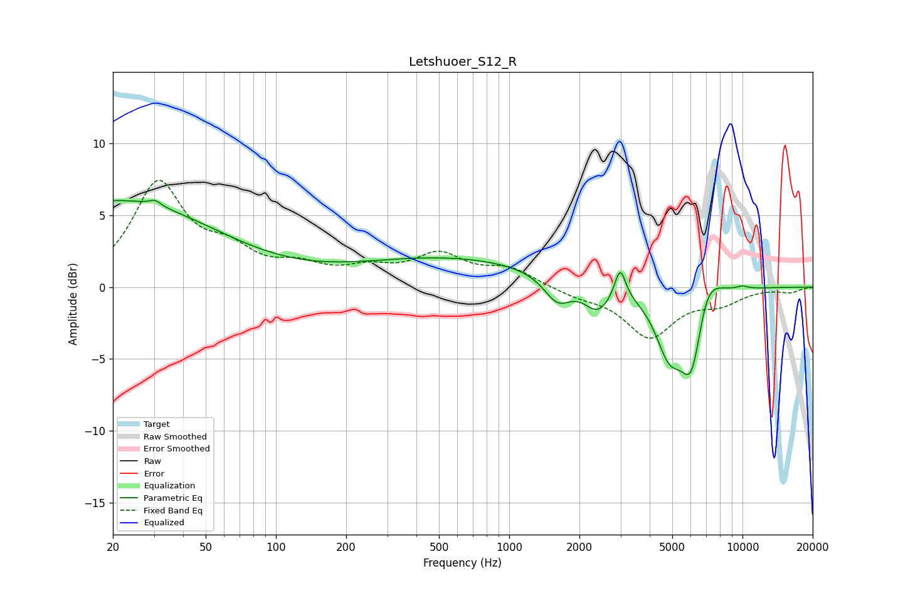

# Letshuoer_S12_R
See [usage instructions](https://github.com/jaakkopasanen/AutoEq#usage) for more options and info.

### Parametric EQs
Apply preamp of -6.1 dB when using parametric equalizer.

|   # | Type    |   Fc (Hz) |    Q |   Gain (dB) |
|-----|---------|-----------|------|-------------|
|   1 | Peaking |        21 | 0.33 |         6   |
|   2 | Peaking |        30 | 5.94 |         0.4 |
|   3 | Peaking |       568 | 0.34 |         2   |
|   4 | Peaking |      1610 | 2.45 |        -1.8 |
|   5 | Peaking |      2388 | 2.44 |        -1.8 |
|   6 | Peaking |      2990 | 6    |         2.2 |
|   7 | Peaking |      4846 | 2.31 |        -4   |
|   8 | Peaking |      6080 | 2.71 |        -6.4 |
|   9 | Peaking |      6855 | 2.2  |         3.2 |
|  10 | Peaking |     10000 | 5.46 |         0.2 |

### Fixed Band EQs
When using fixed band (also called graphic) equalizer, apply preamp of **-7.5 dB** (if available) and set gains manually with these parameters.

|   # | Type    |   Fc (Hz) |    Q |   Gain (dB) |
|-----|---------|-----------|------|-------------|
|   1 | Peaking |        31 | 1.41 |         7   |
|   2 | Peaking |        62 | 1.41 |         2   |
|   3 | Peaking |       125 | 1.41 |         1.2 |
|   4 | Peaking |       250 | 1.41 |         1   |
|   5 | Peaking |       500 | 1.41 |         2.1 |
|   6 | Peaking |      1000 | 1.41 |         1.2 |
|   7 | Peaking |      2000 | 1.41 |        -0.5 |
|   8 | Peaking |      4000 | 1.41 |        -3.4 |
|   9 | Peaking |      8000 | 1.41 |        -1   |
|  10 | Peaking |     16000 | 1.41 |        -0.3 |

### Graphs

