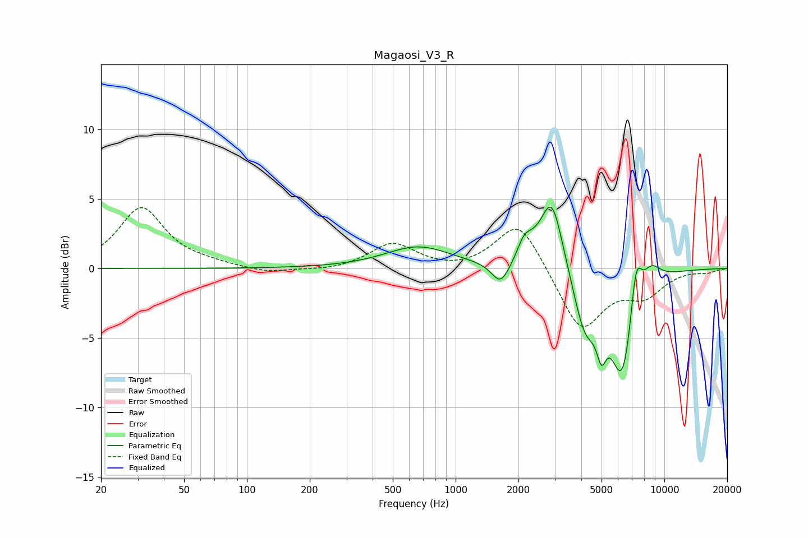

# Magaosi_V3_R
See [usage instructions](https://github.com/jaakkopasanen/AutoEq#usage) for more options and info.

### Parametric EQs
Apply preamp of -4.5 dB when using parametric equalizer.

|   # | Type    |   Fc (Hz) |    Q |   Gain (dB) |
|-----|---------|-----------|------|-------------|
|   1 | Peaking |       662 | 0.9  |         1.6 |
|   2 | Peaking |      1645 | 3.33 |        -1.6 |
|   3 | Peaking |      2125 | 4.34 |         1.2 |
|   4 | Peaking |      2313 | 3.27 |         0.5 |
|   5 | Peaking |      2888 | 2.59 |         5.4 |
|   6 | Peaking |      4169 | 2.45 |        -4.1 |
|   7 | Peaking |      4997 | 6    |        -2.5 |
|   8 | Peaking |      6314 | 2.28 |        -7.9 |
|   9 | Peaking |      7309 | 4.73 |         4   |
|  10 | Peaking |      8626 | 2.82 |         1.5 |

### Fixed Band EQs
When using fixed band (also called graphic) equalizer, apply preamp of **-4.5 dB** (if available) and set gains manually with these parameters.

|   # | Type    |   Fc (Hz) |    Q |   Gain (dB) |
|-----|---------|-----------|------|-------------|
|   1 | Peaking |        31 | 1.41 |         4.3 |
|   2 | Peaking |        62 | 1.41 |         0.2 |
|   3 | Peaking |       125 | 1.41 |        -0.4 |
|   4 | Peaking |       250 | 1.41 |        -0.2 |
|   5 | Peaking |       500 | 1.41 |         1.8 |
|   6 | Peaking |      1000 | 1.41 |        -0.2 |
|   7 | Peaking |      2000 | 1.41 |         3.6 |
|   8 | Peaking |      4000 | 1.41 |        -4.5 |
|   9 | Peaking |      8000 | 1.41 |        -1.7 |
|  10 | Peaking |     16000 | 1.41 |        -0.2 |

### Graphs

