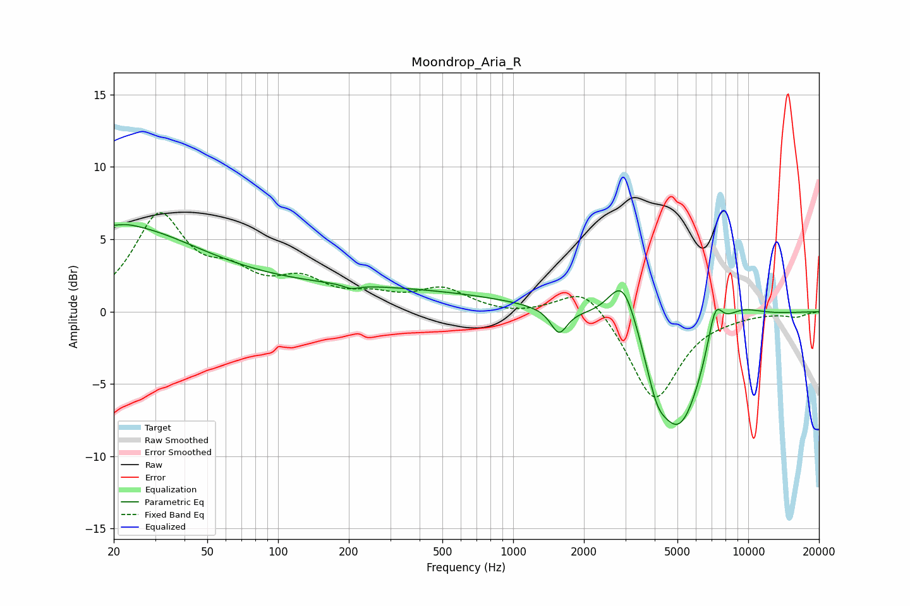

# Moondrop_Aria_R
See [usage instructions](https://github.com/jaakkopasanen/AutoEq#usage) for more options and info.

### Parametric EQs
Apply preamp of -6.1 dB when using parametric equalizer.

|   # | Type    |   Fc (Hz) |    Q |   Gain (dB) |
|-----|---------|-----------|------|-------------|
|   1 | Peaking |        20 | 0.41 |         5.7 |
|   2 | Peaking |        23 | 4.67 |         0.1 |
|   3 | Peaking |       205 | 4.23 |        -0.3 |
|   4 | Peaking |       215 | 0.21 |         1.6 |
|   5 | Peaking |      1567 | 4.09 |        -1.7 |
|   6 | Peaking |      2943 | 2.19 |         4   |
|   7 | Peaking |      4075 | 3.48 |        -1.7 |
|   8 | Peaking |      5071 | 1.23 |        -8.4 |
|   9 | Peaking |      7231 | 4.1  |         2.8 |
|  10 | Peaking |      8852 | 1.25 |         1.6 |

### Fixed Band EQs
When using fixed band (also called graphic) equalizer, apply preamp of **-6.9 dB** (if available) and set gains manually with these parameters.

|   # | Type    |   Fc (Hz) |    Q |   Gain (dB) |
|-----|---------|-----------|------|-------------|
|   1 | Peaking |        31 | 1.41 |         6.4 |
|   2 | Peaking |        62 | 1.41 |         2   |
|   3 | Peaking |       125 | 1.41 |         1.8 |
|   4 | Peaking |       250 | 1.41 |         0.8 |
|   5 | Peaking |       500 | 1.41 |         1.5 |
|   6 | Peaking |      1000 | 1.41 |        -0.2 |
|   7 | Peaking |      2000 | 1.41 |         2   |
|   8 | Peaking |      4000 | 1.41 |        -6.2 |
|   9 | Peaking |      8000 | 1.41 |        -0.2 |
|  10 | Peaking |     16000 | 1.41 |        -0.3 |

### Graphs

