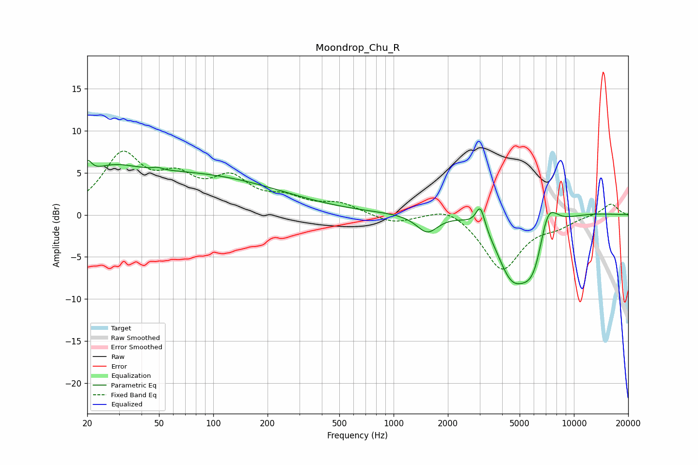

# Moondrop_Chu_R
See [usage instructions](https://github.com/jaakkopasanen/AutoEq#usage) for more options and info.

### Parametric EQs
Apply preamp of -6.6 dB when using parametric equalizer.

|   # | Type    |   Fc (Hz) |    Q |   Gain (dB) |
|-----|---------|-----------|------|-------------|
|   1 | Peaking |        20 | 5.96 |         1.9 |
|   2 | Peaking |        26 | 0.97 |         2.4 |
|   3 | Peaking |        49 | 5.3  |         0.3 |
|   4 | Peaking |        72 | 0.27 |         4.7 |
|   5 | Peaking |      1537 | 2.36 |        -2.2 |
|   6 | Peaking |      3029 | 5.73 |         2.8 |
|   7 | Peaking |      4459 | 1.66 |        -5.8 |
|   8 | Peaking |      5307 | 0.43 |         1.8 |
|   9 | Peaking |      6068 | 1.44 |        -9.4 |
|  10 | Peaking |      7092 | 2.28 |         6.4 |

### Fixed Band EQs
When using fixed band (also called graphic) equalizer, apply preamp of **-7.7 dB** (if available) and set gains manually with these parameters.

|   # | Type    |   Fc (Hz) |    Q |   Gain (dB) |
|-----|---------|-----------|------|-------------|
|   1 | Peaking |        31 | 1.41 |         6.8 |
|   2 | Peaking |        62 | 1.41 |         3.5 |
|   3 | Peaking |       125 | 1.41 |         3.7 |
|   4 | Peaking |       250 | 1.41 |         1.6 |
|   5 | Peaking |       500 | 1.41 |         1.3 |
|   6 | Peaking |      1000 | 1.41 |        -1   |
|   7 | Peaking |      2000 | 1.41 |         1.3 |
|   8 | Peaking |      4000 | 1.41 |        -6.5 |
|   9 | Peaking |      8000 | 1.41 |        -1   |
|  10 | Peaking |     16000 | 1.41 |         1.4 |

### Graphs

