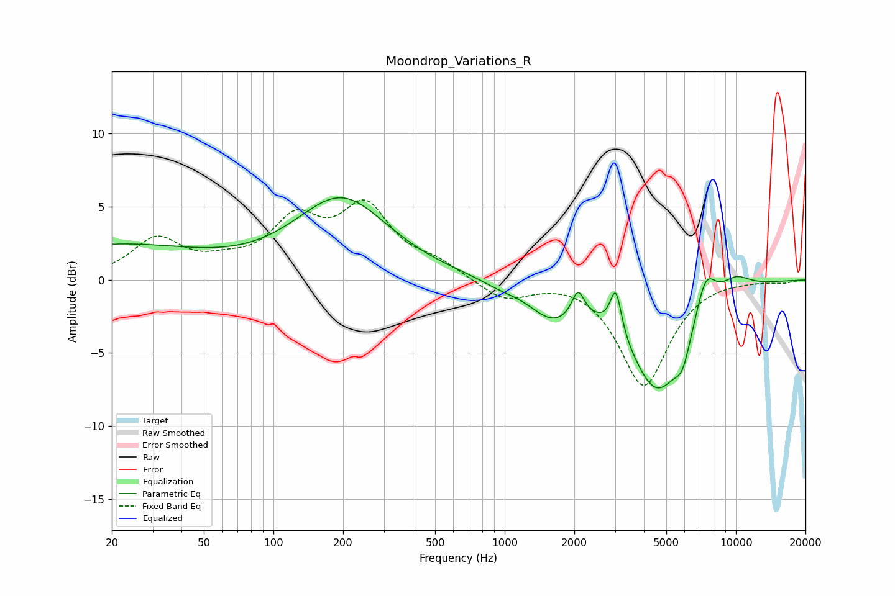

# Moondrop_Variations_R
See [usage instructions](https://github.com/jaakkopasanen/AutoEq#usage) for more options and info.

### Parametric EQs
Apply preamp of -5.7 dB when using parametric equalizer.

|   # | Type    |   Fc (Hz) |    Q |   Gain (dB) |
|-----|---------|-----------|------|-------------|
|   1 | Peaking |        20 | 0.36 |         2.3 |
|   2 | Peaking |       197 | 0.7  |         5.5 |
|   3 | Peaking |       949 | 1.79 |        -0.3 |
|   4 | Peaking |      1608 | 1.39 |        -2.2 |
|   5 | Peaking |      2075 | 5.36 |         1.8 |
|   6 | Peaking |      3025 | 5.97 |         3   |
|   7 | Peaking |      4571 | 1.13 |        -7.4 |
|   8 | Peaking |      5888 | 4.06 |        -1.7 |
|   9 | Peaking |      7406 | 3.08 |         2.6 |
|  10 | Peaking |      9932 | 1.85 |         1   |

### Fixed Band EQs
When using fixed band (also called graphic) equalizer, apply preamp of **-5.6 dB** (if available) and set gains manually with these parameters.

|   # | Type    |   Fc (Hz) |    Q |   Gain (dB) |
|-----|---------|-----------|------|-------------|
|   1 | Peaking |        31 | 1.41 |         2.7 |
|   2 | Peaking |        62 | 1.41 |         0.8 |
|   3 | Peaking |       125 | 1.41 |         3.7 |
|   4 | Peaking |       250 | 1.41 |         4.6 |
|   5 | Peaking |       500 | 1.41 |         1   |
|   6 | Peaking |      1000 | 1.41 |        -1.4 |
|   7 | Peaking |      2000 | 1.41 |         0.2 |
|   8 | Peaking |      4000 | 1.41 |        -7.2 |
|   9 | Peaking |      8000 | 1.41 |         0.1 |
|  10 | Peaking |     16000 | 1.41 |        -0.2 |

### Graphs

