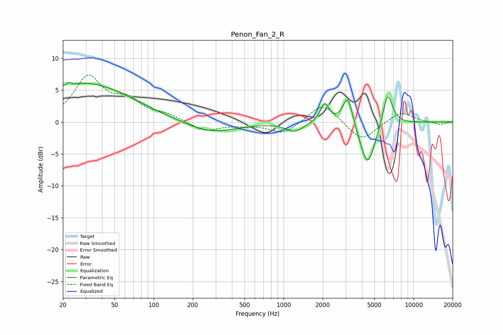

# Penon_Fan_2_R
See [usage instructions](https://github.com/jaakkopasanen/AutoEq#usage) for more options and info.

### Parametric EQs
Apply preamp of -6.3 dB when using parametric equalizer.

|   # | Type    |   Fc (Hz) |    Q |   Gain (dB) |
|-----|---------|-----------|------|-------------|
|   1 | Peaking |        23 | 5.8  |         3.2 |
|   2 | Peaking |        23 | 5.67 |        -2.8 |
|   3 | Peaking |        27 | 0.4  |         5.1 |
|   4 | Peaking |        40 | 0.41 |         1.1 |
|   5 | Peaking |       275 | 0.75 |        -1.8 |
|   6 | Peaking |      1212 | 2.17 |        -1.4 |
|   7 | Peaking |      2067 | 4.19 |         3   |
|   8 | Peaking |      3120 | 3.6  |         4.9 |
|   9 | Peaking |      4424 | 2.35 |        -7.2 |
|  10 | Peaking |      6314 | 3.59 |         5.4 |

### Fixed Band EQs
When using fixed band (also called graphic) equalizer, apply preamp of **-7.5 dB** (if available) and set gains manually with these parameters.

|   # | Type    |   Fc (Hz) |    Q |   Gain (dB) |
|-----|---------|-----------|------|-------------|
|   1 | Peaking |        31 | 1.41 |         6.8 |
|   2 | Peaking |        62 | 1.41 |         2.9 |
|   3 | Peaking |       125 | 1.41 |         0.9 |
|   4 | Peaking |       250 | 1.41 |        -1.5 |
|   5 | Peaking |       500 | 1.41 |        -0.3 |
|   6 | Peaking |      1000 | 1.41 |        -1.9 |
|   7 | Peaking |      2000 | 1.41 |         3.1 |
|   8 | Peaking |      4000 | 1.41 |        -3.1 |
|   9 | Peaking |      8000 | 1.41 |         1.7 |
|  10 | Peaking |     16000 | 1.41 |        -0.4 |

### Graphs

