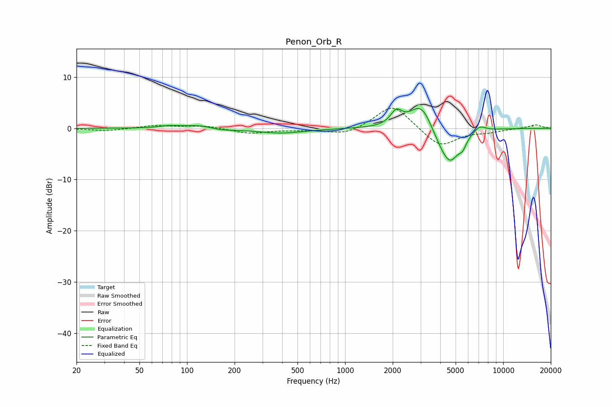

# Penon_Orb_R
See [usage instructions](https://github.com/jaakkopasanen/AutoEq#usage) for more options and info.

### Parametric EQs
Apply preamp of -4.0 dB when using parametric equalizer.

|   # | Type    |   Fc (Hz) |    Q |   Gain (dB) |
|-----|---------|-----------|------|-------------|
|   1 | Peaking |        77 | 2.41 |         0.4 |
|   2 | Peaking |       121 | 1.54 |         0.7 |
|   3 | Peaking |       161 | 1.65 |        -0.4 |
|   4 | Peaking |       392 | 0.93 |        -0.9 |
|   5 | Peaking |      2108 | 3.98 |         2.6 |
|   6 | Peaking |      3052 | 1.9  |         5.6 |
|   7 | Peaking |      3930 | 2.01 |        -2.1 |
|   8 | Peaking |      4615 | 2.31 |        -6.1 |
|   9 | Peaking |      5543 | 5.99 |        -1.6 |
|  10 | Peaking |      7085 | 3.66 |         1.2 |

### Fixed Band EQs
When using fixed band (also called graphic) equalizer, apply preamp of **-4.0 dB** (if available) and set gains manually with these parameters.

|   # | Type    |   Fc (Hz) |    Q |   Gain (dB) |
|-----|---------|-----------|------|-------------|
|   1 | Peaking |        31 | 1.41 |        -0.5 |
|   2 | Peaking |        62 | 1.41 |         0.5 |
|   3 | Peaking |       125 | 1.41 |         0.5 |
|   4 | Peaking |       250 | 1.41 |        -1   |
|   5 | Peaking |       500 | 1.41 |        -0.2 |
|   6 | Peaking |      1000 | 1.41 |        -1.3 |
|   7 | Peaking |      2000 | 1.41 |         4.8 |
|   8 | Peaking |      4000 | 1.41 |        -3.7 |
|   9 | Peaking |      8000 | 1.41 |        -0.6 |
|  10 | Peaking |     16000 | 1.41 |         0.7 |

### Graphs

