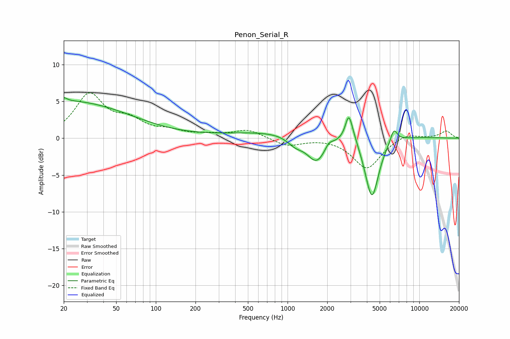

# Penon_Serial_R
See [usage instructions](https://github.com/jaakkopasanen/AutoEq#usage) for more options and info.

### Parametric EQs
Apply preamp of -5.6 dB when using parametric equalizer.

|   # | Type    |   Fc (Hz) |    Q |   Gain (dB) |
|-----|---------|-----------|------|-------------|
|   1 | Peaking |        20 | 5.99 |         0.5 |
|   2 | Peaking |        21 | 0.28 |         5   |
|   3 | Peaking |      1147 | 2.27 |        -1.2 |
|   4 | Peaking |      1611 | 0.22 |         1.1 |
|   5 | Peaking |      1662 | 1.9  |        -3.8 |
|   6 | Peaking |      2055 | 4.95 |         0.7 |
|   7 | Peaking |      2915 | 5.34 |         3.4 |
|   8 | Peaking |      3201 | 4.08 |         0.7 |
|   9 | Peaking |      4367 | 2.62 |        -8.7 |
|  10 | Peaking |      6404 | 5.23 |         1.9 |

### Fixed Band EQs
When using fixed band (also called graphic) equalizer, apply preamp of **-6.3 dB** (if available) and set gains manually with these parameters.

|   # | Type    |   Fc (Hz) |    Q |   Gain (dB) |
|-----|---------|-----------|------|-------------|
|   1 | Peaking |        31 | 1.41 |         5.8 |
|   2 | Peaking |        62 | 1.41 |         2   |
|   3 | Peaking |       125 | 1.41 |         0.8 |
|   4 | Peaking |       250 | 1.41 |         0.4 |
|   5 | Peaking |       500 | 1.41 |         1.1 |
|   6 | Peaking |      1000 | 1.41 |        -1.1 |
|   7 | Peaking |      2000 | 1.41 |         0.1 |
|   8 | Peaking |      4000 | 1.41 |        -4.1 |
|   9 | Peaking |      8000 | 1.41 |         0.8 |
|  10 | Peaking |     16000 | 1.41 |         1   |

### Graphs

