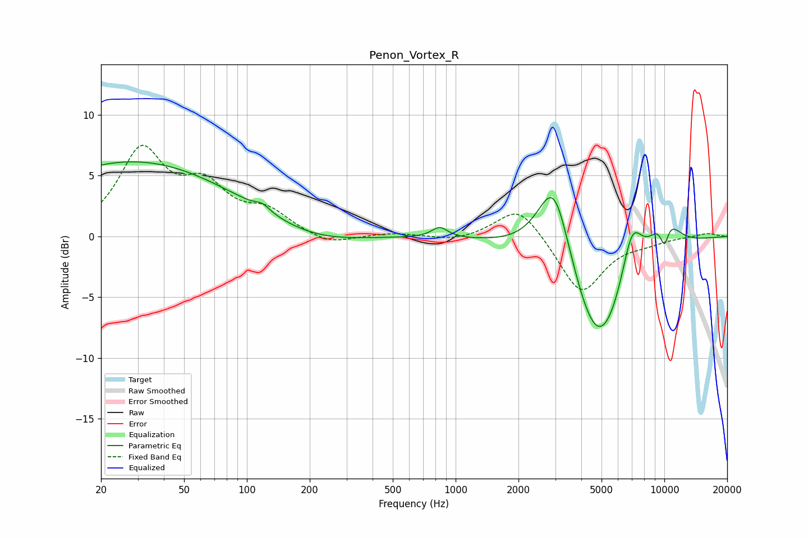

# Penon_Vortex_R
See [usage instructions](https://github.com/jaakkopasanen/AutoEq#usage) for more options and info.

### Parametric EQs
Apply preamp of -6.2 dB when using parametric equalizer.

|   # | Type    |   Fc (Hz) |    Q |   Gain (dB) |
|-----|---------|-----------|------|-------------|
|   1 | Peaking |        29 | 0.29 |         6.1 |
|   2 | Peaking |       119 | 4    |         0.5 |
|   3 | Peaking |       211 | 0.7  |        -0.9 |
|   4 | Peaking |       839 | 3.69 |         0.9 |
|   5 | Peaking |      2969 | 1.68 |         8   |
|   6 | Peaking |      4839 | 0.93 |       -10.5 |
|   7 | Peaking |      6992 | 2.54 |         4.9 |
|   8 | Peaking |      9980 | 1.84 |         3.5 |
|   9 | Peaking |     10000 | 5.9  |        -1.2 |
|  10 | Peaking |     10000 | 4.68 |        -1.2 |

### Fixed Band EQs
When using fixed band (also called graphic) equalizer, apply preamp of **-7.6 dB** (if available) and set gains manually with these parameters.

|   # | Type    |   Fc (Hz) |    Q |   Gain (dB) |
|-----|---------|-----------|------|-------------|
|   1 | Peaking |        31 | 1.41 |         6.8 |
|   2 | Peaking |        62 | 1.41 |         3.5 |
|   3 | Peaking |       125 | 1.41 |         1.8 |
|   4 | Peaking |       250 | 1.41 |        -0.8 |
|   5 | Peaking |       500 | 1.41 |         0.3 |
|   6 | Peaking |      1000 | 1.41 |        -0.4 |
|   7 | Peaking |      2000 | 1.41 |         2.7 |
|   8 | Peaking |      4000 | 1.41 |        -4.8 |
|   9 | Peaking |      8000 | 1.41 |        -0.4 |
|  10 | Peaking |     16000 | 1.41 |         0.3 |

### Graphs

