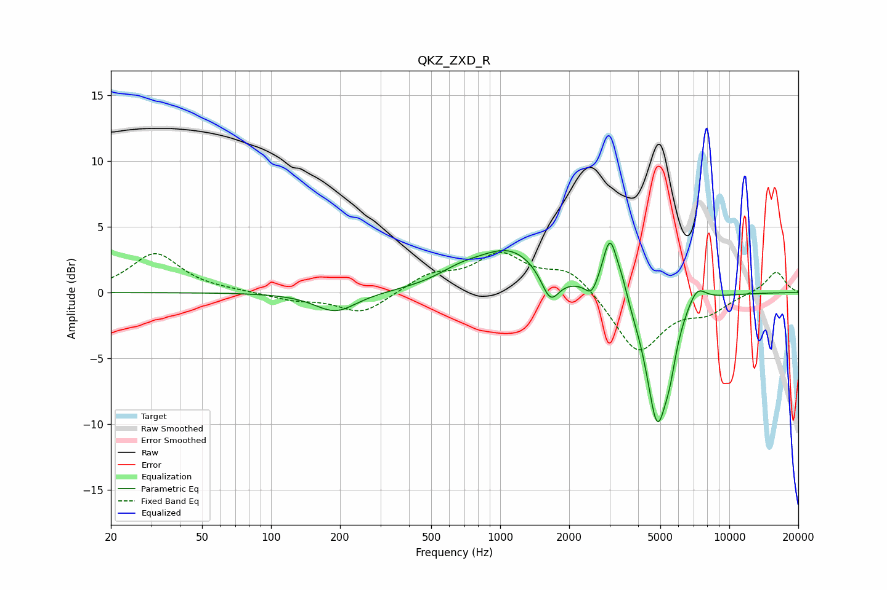

# QKZ_ZXD_R
See [usage instructions](https://github.com/jaakkopasanen/AutoEq#usage) for more options and info.

### Parametric EQs
Apply preamp of -3.9 dB when using parametric equalizer.

|   # | Type    |   Fc (Hz) |    Q |   Gain (dB) |
|-----|---------|-----------|------|-------------|
|   1 | Peaking |       191 | 1.55 |        -1.5 |
|   2 | Peaking |       668 | 1.4  |         0.8 |
|   3 | Peaking |      1108 | 0.96 |         3.2 |
|   4 | Peaking |      1654 | 3.66 |        -2.2 |
|   5 | Peaking |      2504 | 5.43 |        -1   |
|   6 | Peaking |      3017 | 4.33 |         4.5 |
|   7 | Peaking |      3408 | 5.99 |         0.9 |
|   8 | Peaking |      4849 | 2.81 |        -9.9 |
|   9 | Peaking |      5510 | 5.42 |        -1.7 |
|  10 | Peaking |      7203 | 3.3  |         1.5 |

### Fixed Band EQs
When using fixed band (also called graphic) equalizer, apply preamp of **-3.2 dB** (if available) and set gains manually with these parameters.

|   # | Type    |   Fc (Hz) |    Q |   Gain (dB) |
|-----|---------|-----------|------|-------------|
|   1 | Peaking |        31 | 1.41 |         3   |
|   2 | Peaking |        62 | 1.41 |         0.1 |
|   3 | Peaking |       125 | 1.41 |        -0.5 |
|   4 | Peaking |       250 | 1.41 |        -1.6 |
|   5 | Peaking |       500 | 1.41 |         1.3 |
|   6 | Peaking |      1000 | 1.41 |         2.7 |
|   7 | Peaking |      2000 | 1.41 |         1.8 |
|   8 | Peaking |      4000 | 1.41 |        -4.6 |
|   9 | Peaking |      8000 | 1.41 |        -1.3 |
|  10 | Peaking |     16000 | 1.41 |         1.6 |

### Graphs

