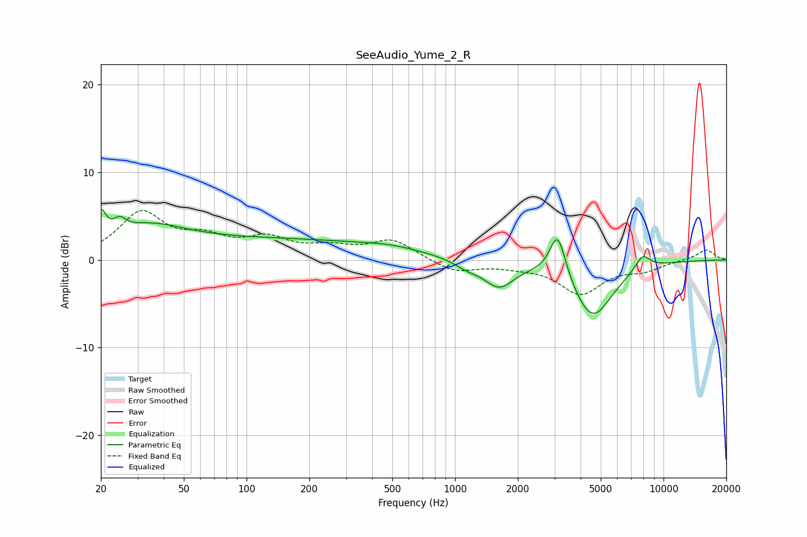

# SeeAudio_Yume_2_R
See [usage instructions](https://github.com/jaakkopasanen/AutoEq#usage) for more options and info.

### Parametric EQs
Apply preamp of -5.8 dB when using parametric equalizer.

|   # | Type    |   Fc (Hz) |    Q |   Gain (dB) |
|-----|---------|-----------|------|-------------|
|   1 | Peaking |        20 | 5.72 |         3.1 |
|   2 | Peaking |        25 | 4.84 |         1.3 |
|   3 | Peaking |        33 | 0.78 |         2.9 |
|   4 | Peaking |       147 | 0.24 |         2.2 |
|   5 | Peaking |       497 | 1.19 |         0.4 |
|   6 | Peaking |      1135 | 2.32 |        -0.8 |
|   7 | Peaking |      1624 | 1.92 |        -2.9 |
|   8 | Peaking |      3108 | 3.65 |         5.3 |
|   9 | Peaking |      4561 | 1.44 |        -6.6 |
|  10 | Peaking |      7940 | 3.68 |         1.7 |

### Fixed Band EQs
When using fixed band (also called graphic) equalizer, apply preamp of **-5.7 dB** (if available) and set gains manually with these parameters.

|   # | Type    |   Fc (Hz) |    Q |   Gain (dB) |
|-----|---------|-----------|------|-------------|
|   1 | Peaking |        31 | 1.41 |         5.2 |
|   2 | Peaking |        62 | 1.41 |         2   |
|   3 | Peaking |       125 | 1.41 |         2.1 |
|   4 | Peaking |       250 | 1.41 |         1.1 |
|   5 | Peaking |       500 | 1.41 |         2.2 |
|   6 | Peaking |      1000 | 1.41 |        -1.4 |
|   7 | Peaking |      2000 | 1.41 |        -0.5 |
|   8 | Peaking |      4000 | 1.41 |        -3.7 |
|   9 | Peaking |      8000 | 1.41 |        -1   |
|  10 | Peaking |     16000 | 1.41 |         1.2 |

### Graphs

