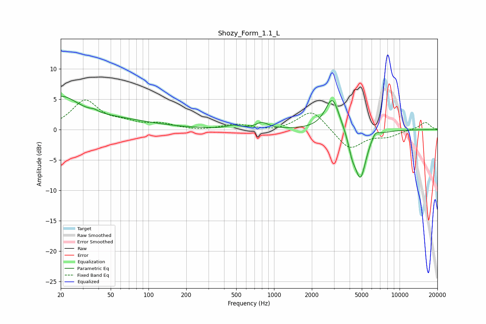

# Shozy_Form_1.1_L
See [usage instructions](https://github.com/jaakkopasanen/AutoEq#usage) for more options and info.

### Parametric EQs
Apply preamp of -5.6 dB when using parametric equalizer.

|   # | Type    |   Fc (Hz) |    Q |   Gain (dB) |
|-----|---------|-----------|------|-------------|
|   1 | Peaking |        20 | 1.14 |         3.8 |
|   2 | Peaking |        34 | 0.32 |         1.9 |
|   3 | Peaking |        37 | 5.29 |         0.3 |
|   4 | Peaking |       476 | 2.76 |         0.5 |
|   5 | Peaking |       813 | 3.32 |         1.6 |
|   6 | Peaking |       823 | 4.35 |        -0.6 |
|   7 | Peaking |      2917 | 2.5  |         5.6 |
|   8 | Peaking |      4177 | 4.95 |        -2.2 |
|   9 | Peaking |      4871 | 2.95 |        -8   |
|  10 | Peaking |      6401 | 4.63 |         1.1 |

### Fixed Band EQs
When using fixed band (also called graphic) equalizer, apply preamp of **-5.0 dB** (if available) and set gains manually with these parameters.

|   # | Type    |   Fc (Hz) |    Q |   Gain (dB) |
|-----|---------|-----------|------|-------------|
|   1 | Peaking |        31 | 1.41 |         4.7 |
|   2 | Peaking |        62 | 1.41 |         0.9 |
|   3 | Peaking |       125 | 1.41 |         0.9 |
|   4 | Peaking |       250 | 1.41 |        -0.2 |
|   5 | Peaking |       500 | 1.41 |         0.9 |
|   6 | Peaking |      1000 | 1.41 |        -0.3 |
|   7 | Peaking |      2000 | 1.41 |         3.3 |
|   8 | Peaking |      4000 | 1.41 |        -3.3 |
|   9 | Peaking |      8000 | 1.41 |        -1   |
|  10 | Peaking |     16000 | 1.41 |         1.2 |

### Graphs

