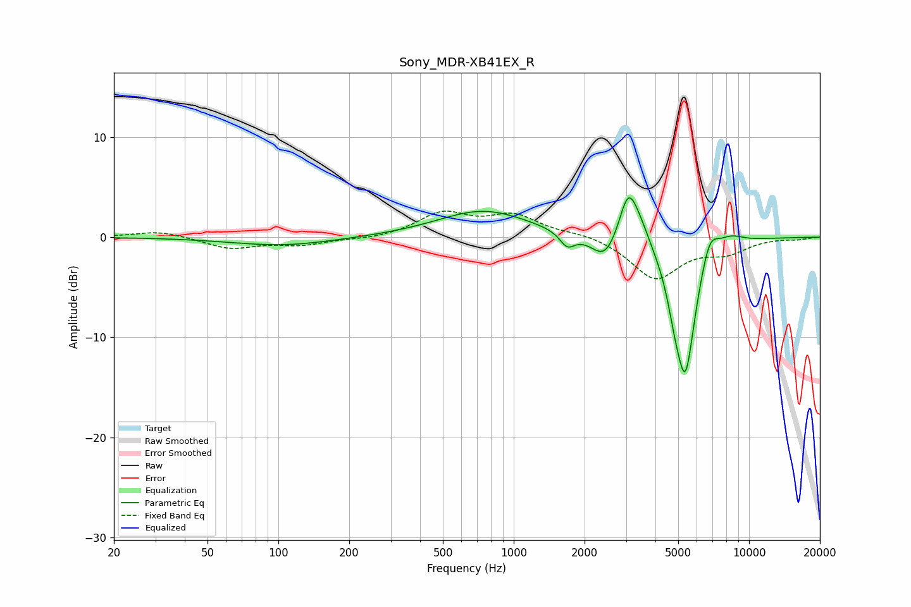

# Sony_MDR-XB41EX_R
See [usage instructions](https://github.com/jaakkopasanen/AutoEq#usage) for more options and info.

### Parametric EQs
Apply preamp of -4.0 dB when using parametric equalizer.

|   # | Type    |   Fc (Hz) |    Q |   Gain (dB) |
|-----|---------|-----------|------|-------------|
|   1 | Peaking |       104 | 0.66 |        -0.8 |
|   2 | Peaking |       744 | 0.73 |         2.7 |
|   3 | Peaking |      1689 | 4.48 |        -1.4 |
|   4 | Peaking |      2447 | 2.47 |        -2.7 |
|   5 | Peaking |      3066 | 3.53 |         4.9 |
|   6 | Peaking |      3438 | 2.87 |         1.7 |
|   7 | Peaking |      4837 | 4.44 |        -2.3 |
|   8 | Peaking |      5364 | 2.97 |       -13.4 |
|   9 | Peaking |      6789 | 3.57 |         2.9 |
|  10 | Peaking |      8333 | 2.34 |         0.9 |

### Fixed Band EQs
When using fixed band (also called graphic) equalizer, apply preamp of **-2.7 dB** (if available) and set gains manually with these parameters.

|   # | Type    |   Fc (Hz) |    Q |   Gain (dB) |
|-----|---------|-----------|------|-------------|
|   1 | Peaking |        31 | 1.41 |         0.6 |
|   2 | Peaking |        62 | 1.41 |        -1.1 |
|   3 | Peaking |       125 | 1.41 |        -0.7 |
|   4 | Peaking |       250 | 1.41 |        -0.2 |
|   5 | Peaking |       500 | 1.41 |         2.3 |
|   6 | Peaking |      1000 | 1.41 |         2   |
|   7 | Peaking |      2000 | 1.41 |         0.4 |
|   8 | Peaking |      4000 | 1.41 |        -4.1 |
|   9 | Peaking |      8000 | 1.41 |        -1.3 |
|  10 | Peaking |     16000 | 1.41 |        -0.2 |

### Graphs

