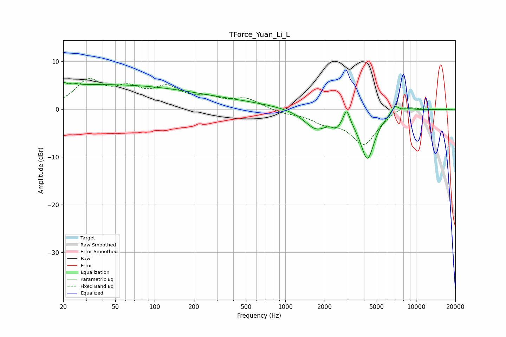

# TForce_Yuan_Li_L
See [usage instructions](https://github.com/jaakkopasanen/AutoEq#usage) for more options and info.

### Parametric EQs
Apply preamp of -5.7 dB when using parametric equalizer.

|   # | Type    |   Fc (Hz) |    Q |   Gain (dB) |
|-----|---------|-----------|------|-------------|
|   1 | Peaking |        22 | 4.79 |         4   |
|   2 | Peaking |        22 | 5.97 |        -3.5 |
|   3 | Peaking |        38 | 0.19 |         5   |
|   4 | Peaking |       377 | 0.39 |         1.2 |
|   5 | Peaking |      1724 | 1.54 |        -4   |
|   6 | Peaking |      2460 | 4.37 |        -1.7 |
|   7 | Peaking |      2948 | 6    |         3.1 |
|   8 | Peaking |      4247 | 2.49 |       -10.2 |
|   9 | Peaking |      6896 | 4.51 |         1.7 |
|  10 | Peaking |      8756 | 2.3  |         0.5 |

### Fixed Band EQs
When using fixed band (also called graphic) equalizer, apply preamp of **-6.5 dB** (if available) and set gains manually with these parameters.

|   # | Type    |   Fc (Hz) |    Q |   Gain (dB) |
|-----|---------|-----------|------|-------------|
|   1 | Peaking |        31 | 1.41 |         5.6 |
|   2 | Peaking |        62 | 1.41 |         3.5 |
|   3 | Peaking |       125 | 1.41 |         3.9 |
|   4 | Peaking |       250 | 1.41 |         1.9 |
|   5 | Peaking |       500 | 1.41 |         2.1 |
|   6 | Peaking |      1000 | 1.41 |        -0.8 |
|   7 | Peaking |      2000 | 1.41 |        -2.2 |
|   8 | Peaking |      4000 | 1.41 |        -7.2 |
|   9 | Peaking |      8000 | 1.41 |         1.3 |
|  10 | Peaking |     16000 | 1.41 |        -0.1 |

### Graphs

