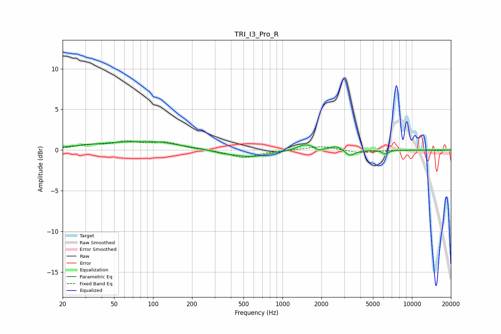

# TRI_I3_Pro_R
See [usage instructions](https://github.com/jaakkopasanen/AutoEq#usage) for more options and info.

### Parametric EQs
Apply preamp of -1.1 dB when using parametric equalizer.

|   # | Type    |   Fc (Hz) |    Q |   Gain (dB) |
|-----|---------|-----------|------|-------------|
|   1 | Peaking |        42 | 5.02 |        -0   |
|   2 | Peaking |        67 | 0.41 |         1   |
|   3 | Peaking |       117 | 1.51 |         0.2 |
|   4 | Peaking |       332 | 2.31 |        -0.2 |
|   5 | Peaking |       553 | 0.97 |        -0.9 |
|   6 | Peaking |      1510 | 2.29 |         0.8 |
|   7 | Peaking |      1906 | 6    |        -0.3 |
|   8 | Peaking |      2618 | 3.43 |         0.5 |
|   9 | Peaking |      3331 | 3.79 |        -0.8 |
|  10 | Peaking |      6242 | 6    |        -0.5 |

### Fixed Band EQs
When using fixed band (also called graphic) equalizer, apply preamp of **-1.2 dB** (if available) and set gains manually with these parameters.

|   # | Type    |   Fc (Hz) |    Q |   Gain (dB) |
|-----|---------|-----------|------|-------------|
|   1 | Peaking |        31 | 1.41 |         0.5 |
|   2 | Peaking |        62 | 1.41 |         0.9 |
|   3 | Peaking |       125 | 1.41 |         0.8 |
|   4 | Peaking |       250 | 1.41 |         0   |
|   5 | Peaking |       500 | 1.41 |        -1   |
|   6 | Peaking |      1000 | 1.41 |        -0   |
|   7 | Peaking |      2000 | 1.41 |         0.5 |
|   8 | Peaking |      4000 | 1.41 |        -0.4 |
|   9 | Peaking |      8000 | 1.41 |        -0   |
|  10 | Peaking |     16000 | 1.41 |        -0.1 |

### Graphs

