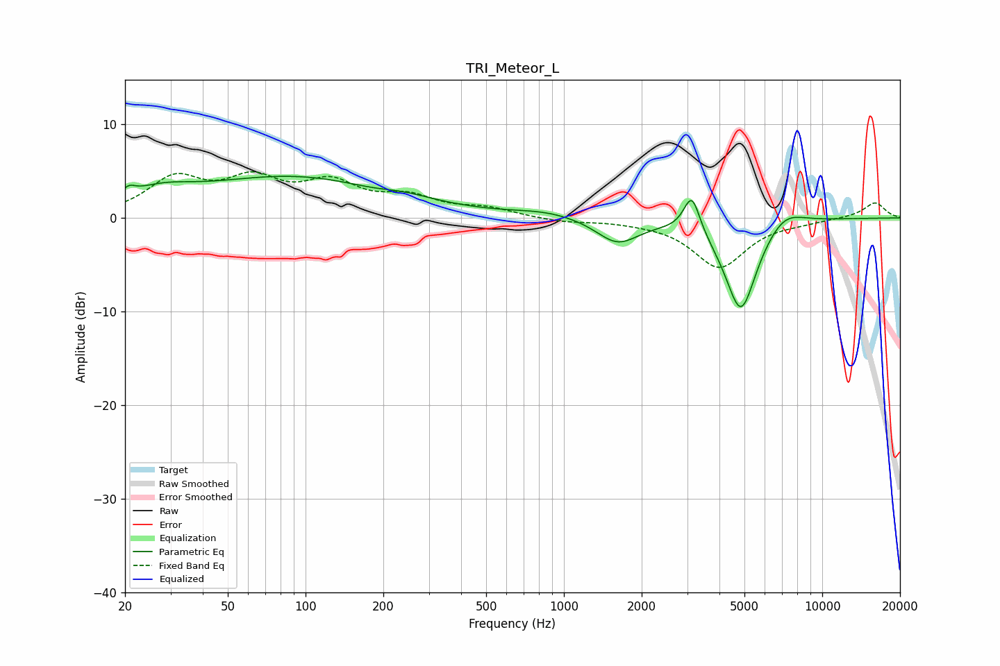

# TRI_Meteor_L
See [usage instructions](https://github.com/jaakkopasanen/AutoEq#usage) for more options and info.

### Parametric EQs
Apply preamp of -4.5 dB when using parametric equalizer.

|   # | Type    |   Fc (Hz) |    Q |   Gain (dB) |
|-----|---------|-----------|------|-------------|
|   1 | Peaking |        21 | 5.45 |         0.9 |
|   2 | Peaking |        27 | 1.09 |         1.8 |
|   3 | Peaking |        93 | 0.37 |         4.4 |
|   4 | Peaking |       211 | 1.07 |        -1.1 |
|   5 | Peaking |       232 | 1.25 |         1.2 |
|   6 | Peaking |       862 | 1.06 |         0.6 |
|   7 | Peaking |      1611 | 1.72 |        -2.7 |
|   8 | Peaking |      3127 | 4.47 |         4.1 |
|   9 | Peaking |      4842 | 2.18 |       -10.1 |
|  10 | Peaking |      7103 | 1.76 |         1.9 |

### Fixed Band EQs
When using fixed band (also called graphic) equalizer, apply preamp of **-5.0 dB** (if available) and set gains manually with these parameters.

|   # | Type    |   Fc (Hz) |    Q |   Gain (dB) |
|-----|---------|-----------|------|-------------|
|   1 | Peaking |        31 | 1.41 |         3.9 |
|   2 | Peaking |        62 | 1.41 |         3.5 |
|   3 | Peaking |       125 | 1.41 |         3.3 |
|   4 | Peaking |       250 | 1.41 |         1.9 |
|   5 | Peaking |       500 | 1.41 |         0.9 |
|   6 | Peaking |      1000 | 1.41 |        -0.4 |
|   7 | Peaking |      2000 | 1.41 |        -0.2 |
|   8 | Peaking |      4000 | 1.41 |        -5.2 |
|   9 | Peaking |      8000 | 1.41 |        -0.3 |
|  10 | Peaking |     16000 | 1.41 |         1.7 |

### Graphs

