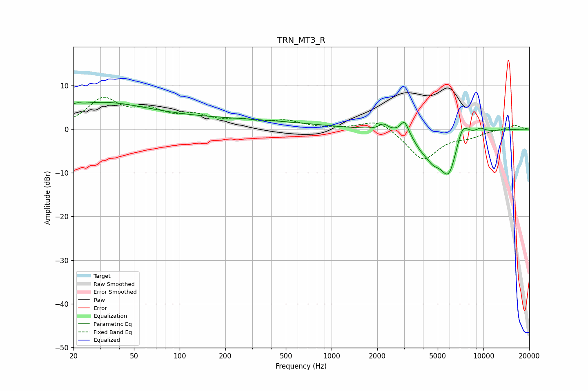

# TRN_MT3_R
See [usage instructions](https://github.com/jaakkopasanen/AutoEq#usage) for more options and info.

### Parametric EQs
Apply preamp of -6.2 dB when using parametric equalizer.

|   # | Type    |   Fc (Hz) |    Q |   Gain (dB) |
|-----|---------|-----------|------|-------------|
|   1 | Peaking |        21 | 5.47 |         0.6 |
|   2 | Peaking |        27 | 0.46 |         4.7 |
|   3 | Peaking |       132 | 0.18 |         2.3 |
|   4 | Peaking |      2199 | 4.96 |         1.4 |
|   5 | Peaking |      3022 | 5.25 |         3.2 |
|   6 | Peaking |      3892 | 2.69 |        -2.1 |
|   7 | Peaking |      4653 | 2.77 |        -3.5 |
|   8 | Peaking |      5907 | 2.21 |       -10.3 |
|   9 | Peaking |      7260 | 3.17 |         4.8 |
|  10 | Peaking |      9536 | 4.19 |         0.9 |

### Fixed Band EQs
When using fixed band (also called graphic) equalizer, apply preamp of **-7.4 dB** (if available) and set gains manually with these parameters.

|   # | Type    |   Fc (Hz) |    Q |   Gain (dB) |
|-----|---------|-----------|------|-------------|
|   1 | Peaking |        31 | 1.41 |         6.5 |
|   2 | Peaking |        62 | 1.41 |         3.5 |
|   3 | Peaking |       125 | 1.41 |         2.5 |
|   4 | Peaking |       250 | 1.41 |         1.6 |
|   5 | Peaking |       500 | 1.41 |         1.7 |
|   6 | Peaking |      1000 | 1.41 |        -0   |
|   7 | Peaking |      2000 | 1.41 |         2.5 |
|   8 | Peaking |      4000 | 1.41 |        -7   |
|   9 | Peaking |      8000 | 1.41 |        -1.4 |
|  10 | Peaking |     16000 | 1.41 |         1   |

### Graphs

