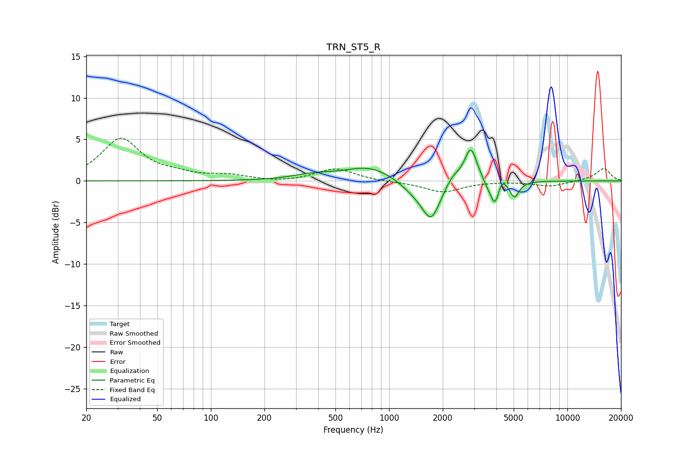

# TRN_ST5_R
See [usage instructions](https://github.com/jaakkopasanen/AutoEq#usage) for more options and info.

### Parametric EQs
Apply preamp of -3.8 dB when using parametric equalizer.

|   # | Type    |   Fc (Hz) |    Q |   Gain (dB) |
|-----|---------|-----------|------|-------------|
|   1 | Peaking |       372 | 1.3  |         0.6 |
|   2 | Peaking |       779 | 0.99 |         1.8 |
|   3 | Peaking |      1411 | 1.63 |        -1.4 |
|   4 | Peaking |      1725 | 2.8  |        -4.2 |
|   5 | Peaking |      2280 | 3.52 |         1   |
|   6 | Peaking |      2871 | 4.06 |         4.2 |
|   7 | Peaking |      3538 | 6    |        -0.5 |
|   8 | Peaking |      3918 | 5.86 |        -3   |
|   9 | Peaking |      4297 | 6    |         1.1 |
|  10 | Peaking |      5049 | 5.43 |        -1.9 |

### Fixed Band EQs
When using fixed band (also called graphic) equalizer, apply preamp of **-5.2 dB** (if available) and set gains manually with these parameters.

|   # | Type    |   Fc (Hz) |    Q |   Gain (dB) |
|-----|---------|-----------|------|-------------|
|   1 | Peaking |        31 | 1.41 |         5   |
|   2 | Peaking |        62 | 1.41 |         0.6 |
|   3 | Peaking |       125 | 1.41 |         0.6 |
|   4 | Peaking |       250 | 1.41 |        -0.2 |
|   5 | Peaking |       500 | 1.41 |         1.5 |
|   6 | Peaking |      1000 | 1.41 |        -0.1 |
|   7 | Peaking |      2000 | 1.41 |        -1.3 |
|   8 | Peaking |      4000 | 1.41 |         0   |
|   9 | Peaking |      8000 | 1.41 |        -0.6 |
|  10 | Peaking |     16000 | 1.41 |         1.5 |

### Graphs

