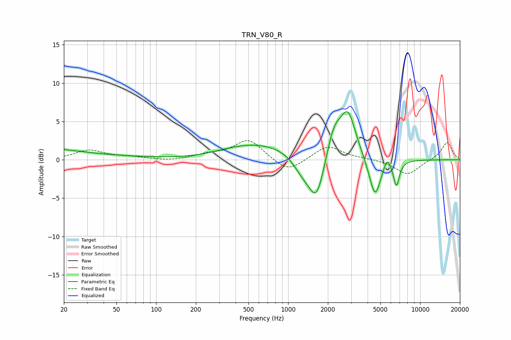

# TRN_V80_R
See [usage instructions](https://github.com/jaakkopasanen/AutoEq#usage) for more options and info.

### Parametric EQs
Apply preamp of -6.4 dB when using parametric equalizer.

|   # | Type    |   Fc (Hz) |    Q |   Gain (dB) |
|-----|---------|-----------|------|-------------|
|   1 | Peaking |        45 | 0.19 |         4.6 |
|   2 | Peaking |        81 | 0.19 |        -4.2 |
|   3 | Peaking |       498 | 0.47 |         3   |
|   4 | Peaking |      1262 | 2.2  |        -1.6 |
|   5 | Peaking |      1635 | 2.28 |        -6   |
|   6 | Peaking |      2227 | 2.57 |         3.7 |
|   7 | Peaking |      2842 | 2.38 |         5.8 |
|   8 | Peaking |      4544 | 3.12 |        -5.2 |
|   9 | Peaking |      5619 | 5.55 |         1.5 |
|  10 | Peaking |      6610 | 6    |        -3.2 |

### Fixed Band EQs
When using fixed band (also called graphic) equalizer, apply preamp of **-2.6 dB** (if available) and set gains manually with these parameters.

|   # | Type    |   Fc (Hz) |    Q |   Gain (dB) |
|-----|---------|-----------|------|-------------|
|   1 | Peaking |        31 | 1.41 |         1.2 |
|   2 | Peaking |        62 | 1.41 |         0.3 |
|   3 | Peaking |       125 | 1.41 |        -0.2 |
|   4 | Peaking |       250 | 1.41 |         0.6 |
|   5 | Peaking |       500 | 1.41 |         2.6 |
|   6 | Peaking |      1000 | 1.41 |        -1.8 |
|   7 | Peaking |      2000 | 1.41 |         1.9 |
|   8 | Peaking |      4000 | 1.41 |         0.1 |
|   9 | Peaking |      8000 | 1.41 |        -2   |
|  10 | Peaking |     16000 | 1.41 |         2.3 |

### Graphs

