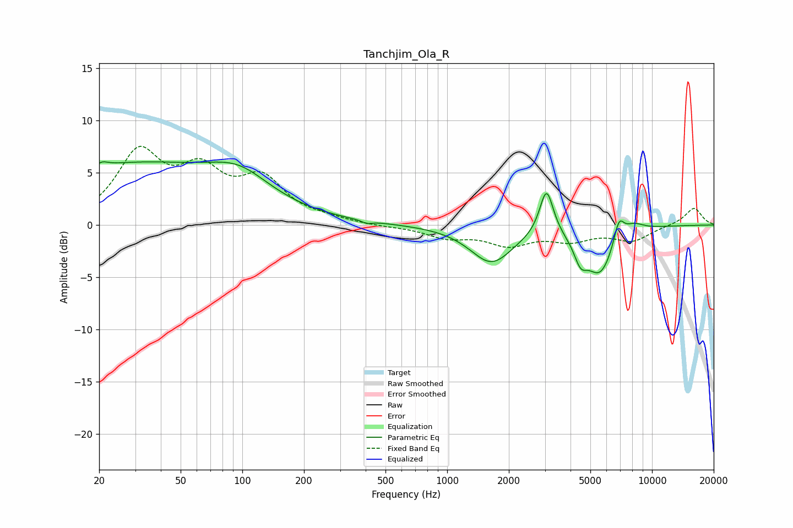

# Tanchjim_Ola_R
See [usage instructions](https://github.com/jaakkopasanen/AutoEq#usage) for more options and info.

### Parametric EQs
Apply preamp of -6.1 dB when using parametric equalizer.

|   # | Type    |   Fc (Hz) |    Q |   Gain (dB) |
|-----|---------|-----------|------|-------------|
|   1 | Peaking |        21 | 5.49 |         0.3 |
|   2 | Peaking |        29 | 0.26 |         5.8 |
|   3 | Peaking |        97 | 0.98 |         2.2 |
|   4 | Peaking |       406 | 5.97 |        -0.3 |
|   5 | Peaking |      1645 | 1.36 |        -3.5 |
|   6 | Peaking |      3054 | 4.24 |         4.5 |
|   7 | Peaking |      4476 | 4.42 |        -1.9 |
|   8 | Peaking |      5575 | 1.95 |        -4.5 |
|   9 | Peaking |      6894 | 5.25 |         2.3 |
|  10 | Peaking |      8079 | 2.57 |         0.9 |

### Fixed Band EQs
When using fixed band (also called graphic) equalizer, apply preamp of **-7.6 dB** (if available) and set gains manually with these parameters.

|   # | Type    |   Fc (Hz) |    Q |   Gain (dB) |
|-----|---------|-----------|------|-------------|
|   1 | Peaking |        31 | 1.41 |         6.5 |
|   2 | Peaking |        62 | 1.41 |         4.4 |
|   3 | Peaking |       125 | 1.41 |         4   |
|   4 | Peaking |       250 | 1.41 |         0.4 |
|   5 | Peaking |       500 | 1.41 |        -0.1 |
|   6 | Peaking |      1000 | 1.41 |        -1.1 |
|   7 | Peaking |      2000 | 1.41 |        -1.7 |
|   8 | Peaking |      4000 | 1.41 |        -1.3 |
|   9 | Peaking |      8000 | 1.41 |        -1.4 |
|  10 | Peaking |     16000 | 1.41 |         1.7 |

### Graphs

