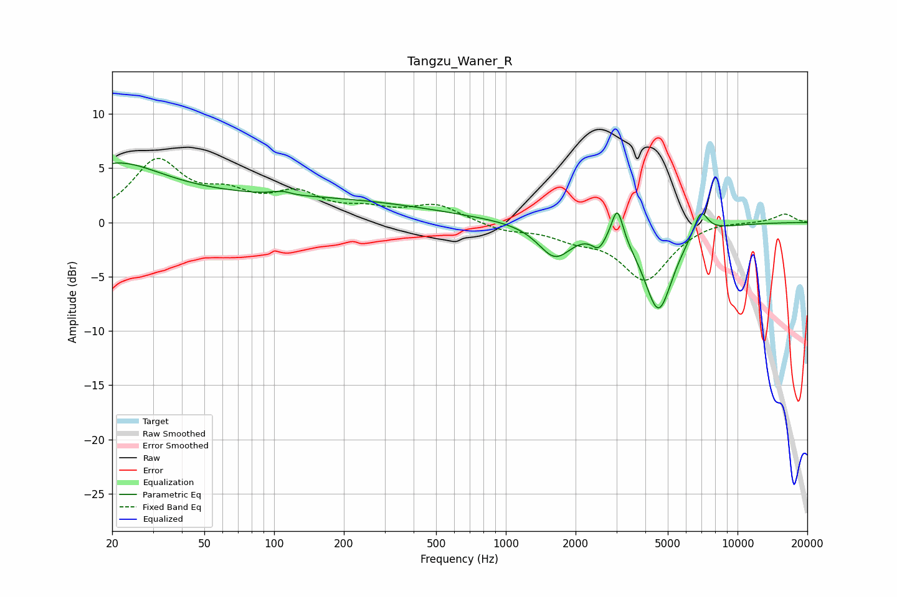

# Tangzu_Waner_R
See [usage instructions](https://github.com/jaakkopasanen/AutoEq#usage) for more options and info.

### Parametric EQs
Apply preamp of -5.6 dB when using parametric equalizer.

|   # | Type    |   Fc (Hz) |    Q |   Gain (dB) |
|-----|---------|-----------|------|-------------|
|   1 | Peaking |        20 | 0.68 |         4.5 |
|   2 | Peaking |       106 | 6    |        -2.1 |
|   3 | Peaking |       107 | 5.61 |         2.4 |
|   4 | Peaking |       113 | 0.22 |         2.2 |
|   5 | Peaking |      1556 | 2.16 |        -0.2 |
|   6 | Peaking |      1636 | 1.96 |        -2.8 |
|   7 | Peaking |      2516 | 4.94 |        -1.3 |
|   8 | Peaking |      3029 | 5.78 |         3.2 |
|   9 | Peaking |      4559 | 2.21 |        -8   |
|  10 | Peaking |      6934 | 4.39 |         2.3 |

### Fixed Band EQs
When using fixed band (also called graphic) equalizer, apply preamp of **-6.0 dB** (if available) and set gains manually with these parameters.

|   # | Type    |   Fc (Hz) |    Q |   Gain (dB) |
|-----|---------|-----------|------|-------------|
|   1 | Peaking |        31 | 1.41 |         5.4 |
|   2 | Peaking |        62 | 1.41 |         2   |
|   3 | Peaking |       125 | 1.41 |         2.3 |
|   4 | Peaking |       250 | 1.41 |         0.9 |
|   5 | Peaking |       500 | 1.41 |         1.6 |
|   6 | Peaking |      1000 | 1.41 |        -0.7 |
|   7 | Peaking |      2000 | 1.41 |        -1.1 |
|   8 | Peaking |      4000 | 1.41 |        -5.2 |
|   9 | Peaking |      8000 | 1.41 |         0.3 |
|  10 | Peaking |     16000 | 1.41 |         0.8 |

### Graphs

