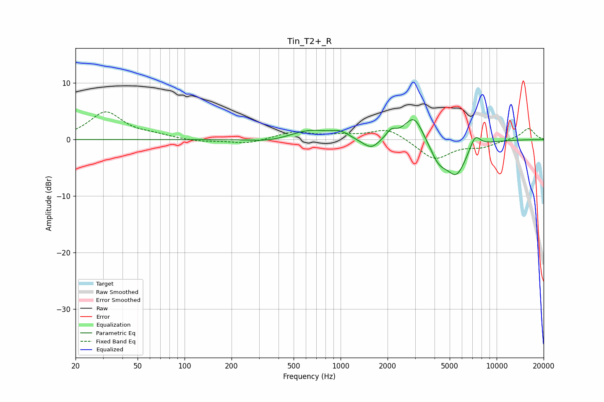

# Tin_T2+_R
See [usage instructions](https://github.com/jaakkopasanen/AutoEq#usage) for more options and info.

### Parametric EQs
Apply preamp of -3.6 dB when using parametric equalizer.

|   # | Type    |   Fc (Hz) |    Q |   Gain (dB) |
|-----|---------|-----------|------|-------------|
|   1 | Peaking |       349 | 1.16 |        -0.5 |
|   2 | Peaking |       632 | 1.15 |         1.7 |
|   3 | Peaking |       992 | 2.45 |         1   |
|   4 | Peaking |      1399 | 2.39 |        -0.5 |
|   5 | Peaking |      1591 | 3.07 |        -1.5 |
|   6 | Peaking |      2114 | 4.73 |         1.3 |
|   7 | Peaking |      2952 | 2.32 |         4.6 |
|   8 | Peaking |      4243 | 2.58 |        -3.1 |
|   9 | Peaking |      5520 | 2.07 |        -5.9 |
|  10 | Peaking |      7276 | 4.03 |         2.5 |

### Fixed Band EQs
When using fixed band (also called graphic) equalizer, apply preamp of **-5.0 dB** (if available) and set gains manually with these parameters.

|   # | Type    |   Fc (Hz) |    Q |   Gain (dB) |
|-----|---------|-----------|------|-------------|
|   1 | Peaking |        31 | 1.41 |         4.8 |
|   2 | Peaking |        62 | 1.41 |         0.6 |
|   3 | Peaking |       125 | 1.41 |        -0.4 |
|   4 | Peaking |       250 | 1.41 |        -0.8 |
|   5 | Peaking |       500 | 1.41 |         1.3 |
|   6 | Peaking |      1000 | 1.41 |         0.6 |
|   7 | Peaking |      2000 | 1.41 |         2   |
|   8 | Peaking |      4000 | 1.41 |        -3.5 |
|   9 | Peaking |      8000 | 1.41 |        -1.1 |
|  10 | Peaking |     16000 | 1.41 |         2   |

### Graphs

