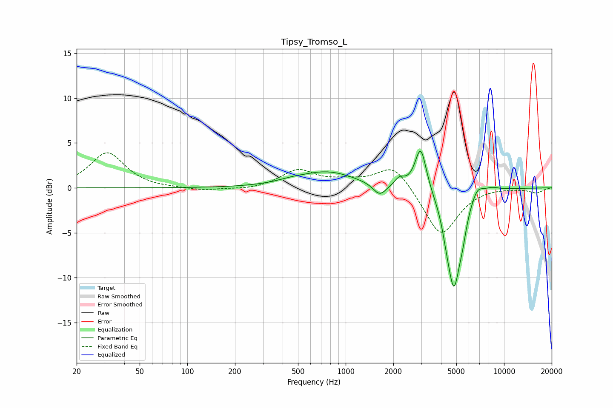

# Tipsy_Tromso_L
See [usage instructions](https://github.com/jaakkopasanen/AutoEq#usage) for more options and info.

### Parametric EQs
Apply preamp of -4.2 dB when using parametric equalizer.

|   # | Type    |   Fc (Hz) |    Q |   Gain (dB) |
|-----|---------|-----------|------|-------------|
|   1 | Peaking |       451 | 1.65 |         0.2 |
|   2 | Peaking |       763 | 0.79 |         1.8 |
|   3 | Peaking |      1641 | 3.41 |        -1.4 |
|   4 | Peaking |      2190 | 4.67 |         0.9 |
|   5 | Peaking |      2977 | 3.93 |         5   |
|   6 | Peaking |      4318 | 6    |        -1   |
|   7 | Peaking |      4818 | 3.16 |       -10.7 |
|   8 | Peaking |      5463 | 5.44 |        -1.5 |
|   9 | Peaking |      6772 | 3.59 |         1.3 |
|  10 | Peaking |      8340 | 2.72 |         0.4 |

### Fixed Band EQs
When using fixed band (also called graphic) equalizer, apply preamp of **-4.0 dB** (if available) and set gains manually with these parameters.

|   # | Type    |   Fc (Hz) |    Q |   Gain (dB) |
|-----|---------|-----------|------|-------------|
|   1 | Peaking |        31 | 1.41 |         3.9 |
|   2 | Peaking |        62 | 1.41 |        -0.1 |
|   3 | Peaking |       125 | 1.41 |        -0.3 |
|   4 | Peaking |       250 | 1.41 |        -0.2 |
|   5 | Peaking |       500 | 1.41 |         1.9 |
|   6 | Peaking |      1000 | 1.41 |         0.6 |
|   7 | Peaking |      2000 | 1.41 |         2.7 |
|   8 | Peaking |      4000 | 1.41 |        -5.5 |
|   9 | Peaking |      8000 | 1.41 |         0.1 |
|  10 | Peaking |     16000 | 1.41 |        -0.5 |

### Graphs

