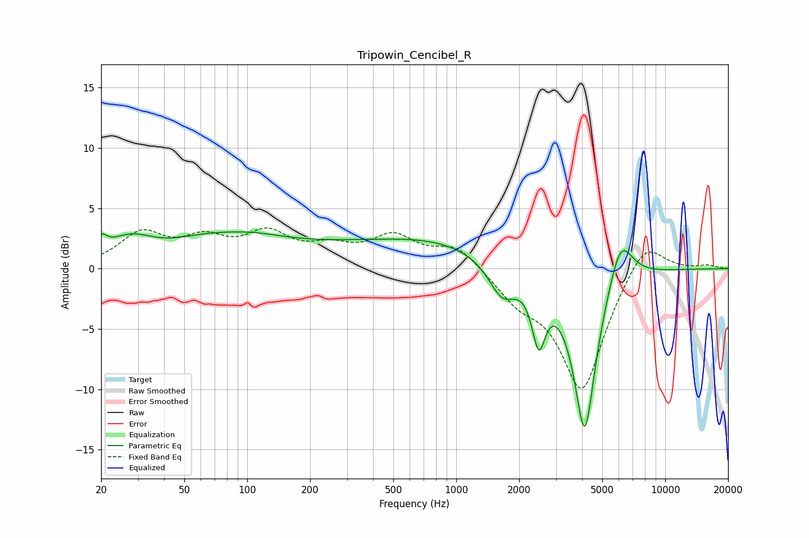

# Tripowin_Cencibel_R
See [usage instructions](https://github.com/jaakkopasanen/AutoEq#usage) for more options and info.

### Parametric EQs
Apply preamp of -3.1 dB when using parametric equalizer.

|   # | Type    |   Fc (Hz) |    Q |   Gain (dB) |
|-----|---------|-----------|------|-------------|
|   1 | Peaking |        20 | 5.25 |         1.2 |
|   2 | Peaking |        27 | 1.21 |         2.1 |
|   3 | Peaking |        60 | 0.83 |         1.4 |
|   4 | Peaking |       104 | 0.83 |         1.1 |
|   5 | Peaking |       269 | 0.36 |         1.6 |
|   6 | Peaking |       876 | 0.52 |         1.6 |
|   7 | Peaking |      1660 | 2.18 |        -2.8 |
|   8 | Peaking |      2483 | 4.4  |        -4.9 |
|   9 | Peaking |      4122 | 2.52 |       -13.8 |
|  10 | Peaking |      6107 | 2.37 |         4   |

### Fixed Band EQs
When using fixed band (also called graphic) equalizer, apply preamp of **-3.5 dB** (if available) and set gains manually with these parameters.

|   # | Type    |   Fc (Hz) |    Q |   Gain (dB) |
|-----|---------|-----------|------|-------------|
|   1 | Peaking |        31 | 1.41 |         2.7 |
|   2 | Peaking |        62 | 1.41 |         2   |
|   3 | Peaking |       125 | 1.41 |         2.6 |
|   4 | Peaking |       250 | 1.41 |         1.4 |
|   5 | Peaking |       500 | 1.41 |         2.4 |
|   6 | Peaking |      1000 | 1.41 |         1.9 |
|   7 | Peaking |      2000 | 1.41 |        -2.1 |
|   8 | Peaking |      4000 | 1.41 |       -10   |
|   9 | Peaking |      8000 | 1.41 |         2.9 |
|  10 | Peaking |     16000 | 1.41 |         0.3 |

### Graphs

