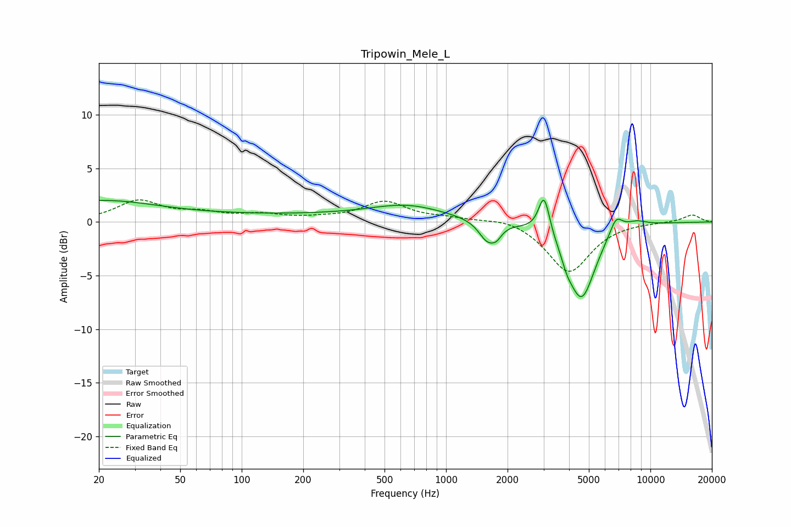

# Tripowin_Mele_L
See [usage instructions](https://github.com/jaakkopasanen/AutoEq#usage) for more options and info.

### Parametric EQs
Apply preamp of -2.1 dB when using parametric equalizer.

|   # | Type    |   Fc (Hz) |    Q |   Gain (dB) |
|-----|---------|-----------|------|-------------|
|   1 | Peaking |        20 | 0.5  |         1.9 |
|   2 | Peaking |       211 | 0.2  |         0.6 |
|   3 | Peaking |       648 | 0.81 |         1.1 |
|   4 | Peaking |      1592 | 3.37 |        -1.8 |
|   5 | Peaking |      1767 | 5.43 |        -0.8 |
|   6 | Peaking |      3020 | 5.18 |         3.7 |
|   7 | Peaking |      3903 | 5.69 |        -0.8 |
|   8 | Peaking |      4593 | 2.04 |        -7.1 |
|   9 | Peaking |      6791 | 4.2  |         1.6 |
|  10 | Peaking |      8497 | 2.43 |         0.5 |

### Fixed Band EQs
When using fixed band (also called graphic) equalizer, apply preamp of **-2.2 dB** (if available) and set gains manually with these parameters.

|   # | Type    |   Fc (Hz) |    Q |   Gain (dB) |
|-----|---------|-----------|------|-------------|
|   1 | Peaking |        31 | 1.41 |         1.9 |
|   2 | Peaking |        62 | 1.41 |         0.7 |
|   3 | Peaking |       125 | 1.41 |         0.6 |
|   4 | Peaking |       250 | 1.41 |         0.2 |
|   5 | Peaking |       500 | 1.41 |         1.8 |
|   6 | Peaking |      1000 | 1.41 |         0.3 |
|   7 | Peaking |      2000 | 1.41 |         0.5 |
|   8 | Peaking |      4000 | 1.41 |        -4.7 |
|   9 | Peaking |      8000 | 1.41 |         0   |
|  10 | Peaking |     16000 | 1.41 |         0.7 |

### Graphs

