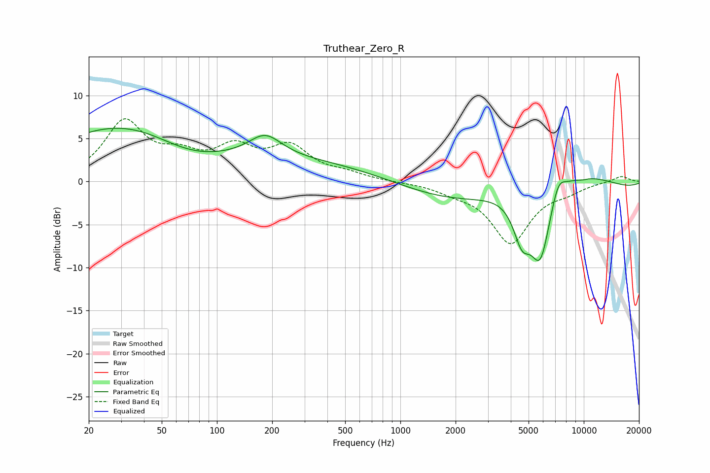

# Truthear_Zero_R
See [usage instructions](https://github.com/jaakkopasanen/AutoEq#usage) for more options and info.

### Parametric EQs
Apply preamp of -6.3 dB when using parametric equalizer.

|   # | Type    |   Fc (Hz) |    Q |   Gain (dB) |
|-----|---------|-----------|------|-------------|
|   1 | Peaking |        29 | 0.37 |         5.8 |
|   2 | Peaking |        70 | 0.66 |        -2.4 |
|   3 | Peaking |       178 | 0.18 |         2.7 |
|   4 | Peaking |       183 | 1.58 |         2.6 |
|   5 | Peaking |      4599 | 2.9  |        -4.7 |
|   6 | Peaking |      5800 | 2.34 |        -8.7 |
|   7 | Peaking |      6196 | 0.2  |        -7.2 |
|   8 | Peaking |      7251 | 3.5  |         2.2 |
|   9 | Peaking |      7586 | 0.33 |         8.3 |
|  10 | Peaking |      9845 | 4.13 |        -0.2 |

### Fixed Band EQs
When using fixed band (also called graphic) equalizer, apply preamp of **-7.4 dB** (if available) and set gains manually with these parameters.

|   # | Type    |   Fc (Hz) |    Q |   Gain (dB) |
|-----|---------|-----------|------|-------------|
|   1 | Peaking |        31 | 1.41 |         6.7 |
|   2 | Peaking |        62 | 1.41 |         2.3 |
|   3 | Peaking |       125 | 1.41 |         3.4 |
|   4 | Peaking |       250 | 1.41 |         3.7 |
|   5 | Peaking |       500 | 1.41 |         0.7 |
|   6 | Peaking |      1000 | 1.41 |        -0   |
|   7 | Peaking |      2000 | 1.41 |        -0.8 |
|   8 | Peaking |      4000 | 1.41 |        -7   |
|   9 | Peaking |      8000 | 1.41 |        -0.8 |
|  10 | Peaking |     16000 | 1.41 |         0.7 |

### Graphs

