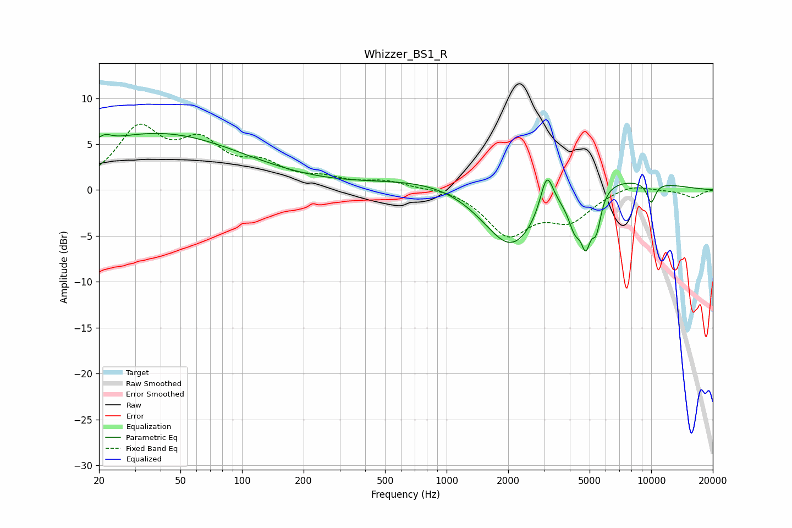

# Whizzer_BS1_R
See [usage instructions](https://github.com/jaakkopasanen/AutoEq#usage) for more options and info.

### Parametric EQs
Apply preamp of -6.3 dB when using parametric equalizer.

|   # | Type    |   Fc (Hz) |    Q |   Gain (dB) |
|-----|---------|-----------|------|-------------|
|   1 | Peaking |        21 | 5.7  |        -1.7 |
|   2 | Peaking |        21 | 5.03 |         2.5 |
|   3 | Peaking |        39 | 0.33 |         6.1 |
|   4 | Peaking |      2083 | 0.89 |        -9   |
|   5 | Peaking |      2450 | 0.24 |         3.2 |
|   6 | Peaking |      3088 | 4.42 |         4.3 |
|   7 | Peaking |      4238 | 4.23 |        -3.5 |
|   8 | Peaking |      4792 | 5.95 |        -4.6 |
|   9 | Peaking |      5390 | 5.95 |        -3.8 |
|  10 | Peaking |     10000 | 5.58 |        -2.2 |

### Fixed Band EQs
When using fixed band (also called graphic) equalizer, apply preamp of **-7.3 dB** (if available) and set gains manually with these parameters.

|   # | Type    |   Fc (Hz) |    Q |   Gain (dB) |
|-----|---------|-----------|------|-------------|
|   1 | Peaking |        31 | 1.41 |         6.2 |
|   2 | Peaking |        62 | 1.41 |         4.4 |
|   3 | Peaking |       125 | 1.41 |         2.3 |
|   4 | Peaking |       250 | 1.41 |         1   |
|   5 | Peaking |       500 | 1.41 |         0.9 |
|   6 | Peaking |      1000 | 1.41 |         0.3 |
|   7 | Peaking |      2000 | 1.41 |        -4.7 |
|   8 | Peaking |      4000 | 1.41 |        -3   |
|   9 | Peaking |      8000 | 1.41 |         0.8 |
|  10 | Peaking |     16000 | 1.41 |        -0.8 |

### Graphs

