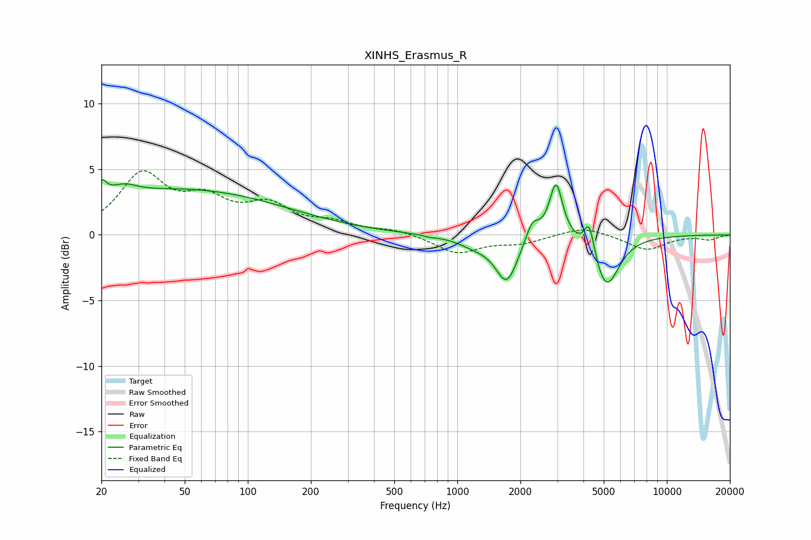

# XINHS_Erasmus_R
See [usage instructions](https://github.com/jaakkopasanen/AutoEq#usage) for more options and info.

### Parametric EQs
Apply preamp of -4.3 dB when using parametric equalizer.

|   # | Type    |   Fc (Hz) |    Q |   Gain (dB) |
|-----|---------|-----------|------|-------------|
|   1 | Peaking |        20 | 5.97 |         1.2 |
|   2 | Peaking |        25 | 2.25 |         0.8 |
|   3 | Peaking |        49 | 0.28 |         3.4 |
|   4 | Peaking |       741 | 5.96 |        -0.1 |
|   5 | Peaking |      1229 | 1.61 |        -0.7 |
|   6 | Peaking |      1722 | 2.7  |        -3.4 |
|   7 | Peaking |      2282 | 4.39 |         1.5 |
|   8 | Peaking |      2959 | 4.49 |         4.3 |
|   9 | Peaking |      4265 | 6    |         2.4 |
|  10 | Peaking |      5142 | 2.32 |        -4   |

### Fixed Band EQs
When using fixed band (also called graphic) equalizer, apply preamp of **-5.0 dB** (if available) and set gains manually with these parameters.

|   # | Type    |   Fc (Hz) |    Q |   Gain (dB) |
|-----|---------|-----------|------|-------------|
|   1 | Peaking |        31 | 1.41 |         4.4 |
|   2 | Peaking |        62 | 1.41 |         2.2 |
|   3 | Peaking |       125 | 1.41 |         2   |
|   4 | Peaking |       250 | 1.41 |         0.8 |
|   5 | Peaking |       500 | 1.41 |         0.4 |
|   6 | Peaking |      1000 | 1.41 |        -1.4 |
|   7 | Peaking |      2000 | 1.41 |        -0.6 |
|   8 | Peaking |      4000 | 1.41 |         0.7 |
|   9 | Peaking |      8000 | 1.41 |        -1.1 |
|  10 | Peaking |     16000 | 1.41 |        -0.3 |

### Graphs

