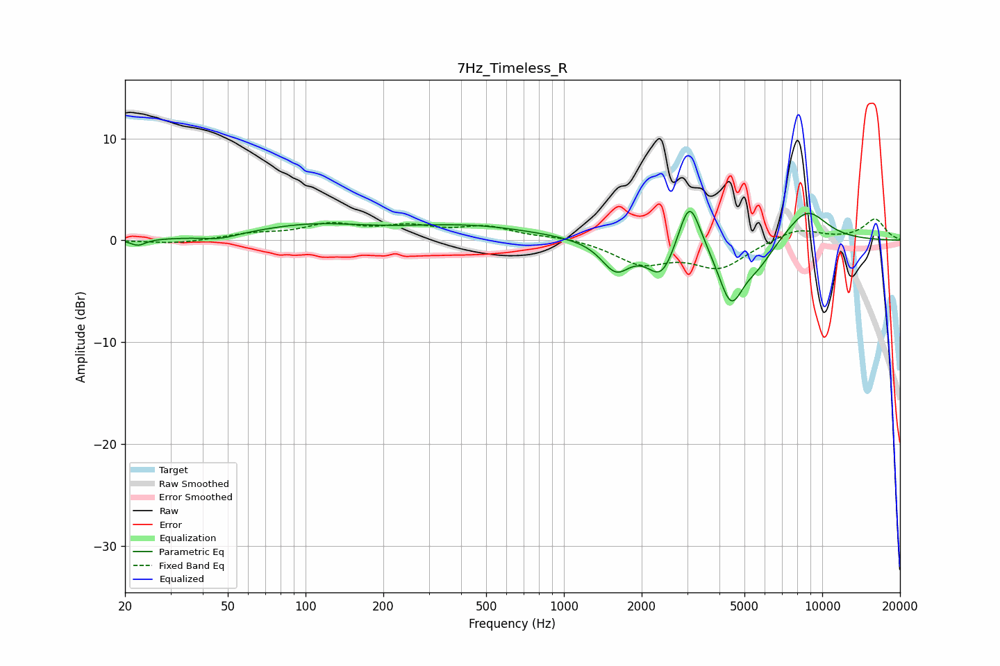

# 7Hz_Timeless_R
See [usage instructions](https://github.com/jaakkopasanen/AutoEq#usage) for more options and info.

### Parametric EQs
Apply preamp of -2.9 dB when using parametric equalizer.

|   # | Type    |   Fc (Hz) |    Q |   Gain (dB) |
|-----|---------|-----------|------|-------------|
|   1 | Peaking |        22 | 5.02 |        -0.6 |
|   2 | Peaking |        47 | 2.18 |        -0.4 |
|   3 | Peaking |       104 | 0.64 |         1.4 |
|   4 | Peaking |       429 | 0.54 |         1.3 |
|   5 | Peaking |      1589 | 2.52 |        -2.9 |
|   6 | Peaking |      2386 | 2.63 |        -3.5 |
|   7 | Peaking |      3062 | 3.33 |         5.3 |
|   8 | Peaking |      4431 | 2.81 |        -5.8 |
|   9 | Peaking |      5631 | 2.12 |        -2   |
|  10 | Peaking |      8703 | 1.59 |         3.2 |

### Fixed Band EQs
When using fixed band (also called graphic) equalizer, apply preamp of **-2.2 dB** (if available) and set gains manually with these parameters.

|   # | Type    |   Fc (Hz) |    Q |   Gain (dB) |
|-----|---------|-----------|------|-------------|
|   1 | Peaking |        31 | 1.41 |        -0.4 |
|   2 | Peaking |        62 | 1.41 |         0.5 |
|   3 | Peaking |       125 | 1.41 |         1.4 |
|   4 | Peaking |       250 | 1.41 |         1.1 |
|   5 | Peaking |       500 | 1.41 |         1.2 |
|   6 | Peaking |      1000 | 1.41 |         0.3 |
|   7 | Peaking |      2000 | 1.41 |        -2.2 |
|   8 | Peaking |      4000 | 1.41 |        -2.6 |
|   9 | Peaking |      8000 | 1.41 |         1.2 |
|  10 | Peaking |     16000 | 1.41 |         2.1 |

### Graphs

